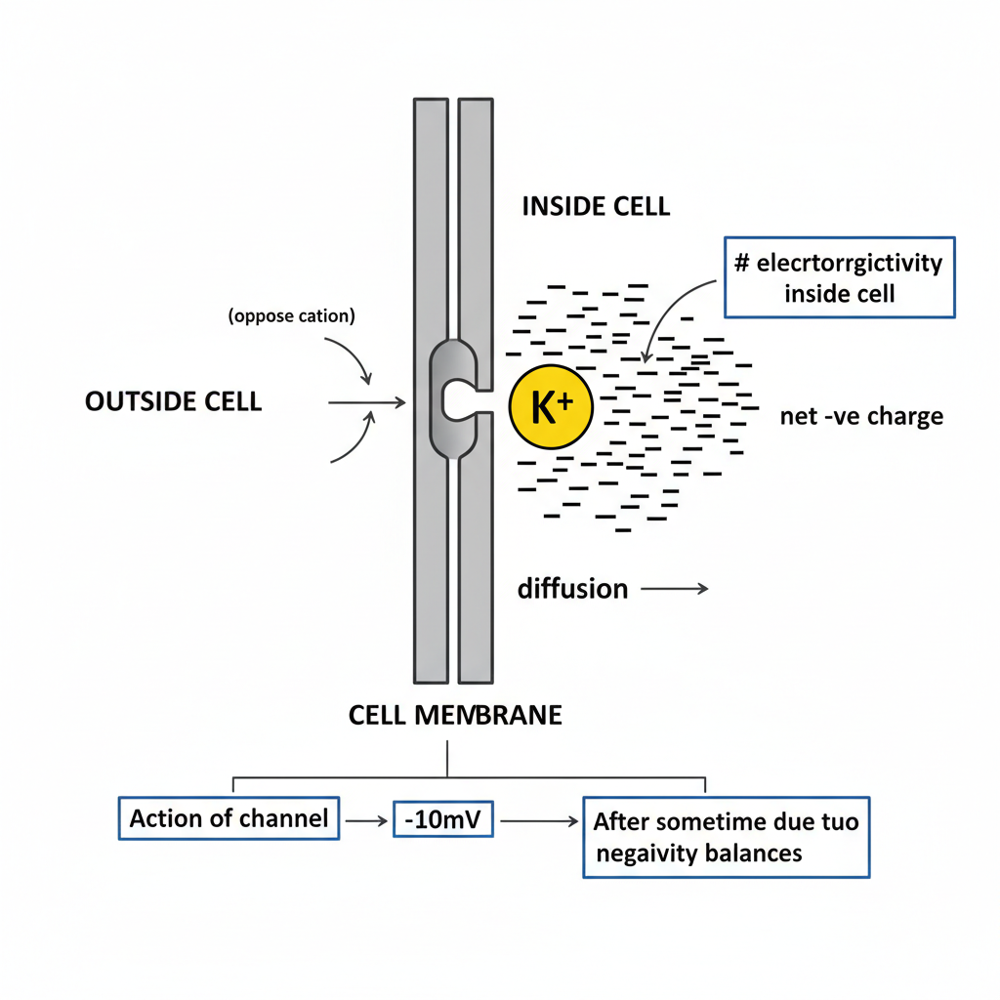

# Biomedical Signal Processing: Resting Potential

## 1. Key Definitions

*   **Resting Potential:** The electrical charge difference across the plasma membrane of a cell when it is in a non-excited state, or at rest. It is the charge associated with a resting cell.
*   **Action Potential:** A rapid, temporary change in the membrane potential of a cell, which is used for communication between cells, such as neurons and muscle cells.

## 2. The Cellular Environment

The resting potential is established by the interaction between the cell's membrane, various ion channels, and the differing ion concentrations inside and outside the cell.

### Components:

*   **Cell Membrane:** A lipid bilayer that separates the intracellular fluid from the extracellular fluid. It is selectively permeable to ions.
*   **Intracellular Fluid (ICF):** The fluid within the cell. It has a high concentration of potassium (K+) ions and low concentration of sodium (Na+) ions.
*   **Extracellular Fluid (ECF):** The fluid outside the cell. It has a high concentration of Na+, Chloride (Cl-), and Calcium (Ca2+) ions, and a low concentration of K+ ions.
*   **Ion Channels & Pumps:**
    *   **Leaky K+ Channel:** An uncontrolled, passive channel that is always open, allowing K+ ions to move across the membrane according to their concentration gradient.
    *   **Voltage-Gated Na+ Channel:** A channel that opens and closes in response to changes in membrane voltage. It is crucial for generating action potentials.
    *   **Sodium-Potassium Pump (Na+/K+ ATPase):** An active transport mechanism that pumps 3 Na+ ions out of the cell for every 2 K+ ions it pumps in. This process requires energy.

## 3. The Role of ATP (Adenosine Triphosphate)

The Na+/K+ pump is powered by ATP, the primary energy currency of the cell.

*   **Hydrolysis:** The pump uses the energy released from the hydrolysis of ATP.
    *   ``ATP + H₂O → ADP + Pᵢ + Energy``
*   **(Note:** The notes state ATP is made in the nucleus. While the nucleus directs protein synthesis, ATP is primarily synthesized in the mitochondria through cellular respiration.)

## 4. Examples of Resting Potential (R.P.) in Different Cells

The resting potential varies depending on the cell type:

*   **Skeletal Muscle:** -90mV
*   **Neuron Cell:** -60mV
*   **Smooth Muscle Cell:** -60mV
*   **Cardiac Cell:** ≈ -50mV to -90mV
*   **Cartilage:** -8mV
*   **Red Blood Cell (RBC):** -8.4mV

## 5. Establishment of the Resting Potential in a Neuron (-60mV)

The resting potential is primarily established by the outward diffusion of K+ ions through leaky K+ channels.

### Step 1: K+ Concentration Gradient
There is a high concentration of K+ inside the cell (e.g., 140 mmole/lt) and a low concentration outside (e.g., 4 mmole/lt). This chemical gradient drives K+ ions to move out of the cell.

### Step 2: K+ Efflux and Charge Separation
As positively charged K+ ions (cations) diffuse out of the cell through the leaky channels, they leave behind a net negative charge inside the cell. This creates an electrical gradient.

### Step 3: Electrochemical Equilibrium

The outward movement of K+ ions makes the inside of the cell progressively more negative (e.g., -5mV, -10mV...). This internal negativity creates an electrical force that pulls the positive K+ ions back into the cell.

The efflux of K+ continues until the outward force from the concentration gradient is perfectly balanced by the inward electrical force. This point of equilibrium is the **resting membrane potential**. For a neuron, this value is approximately **-60mV**.

---

