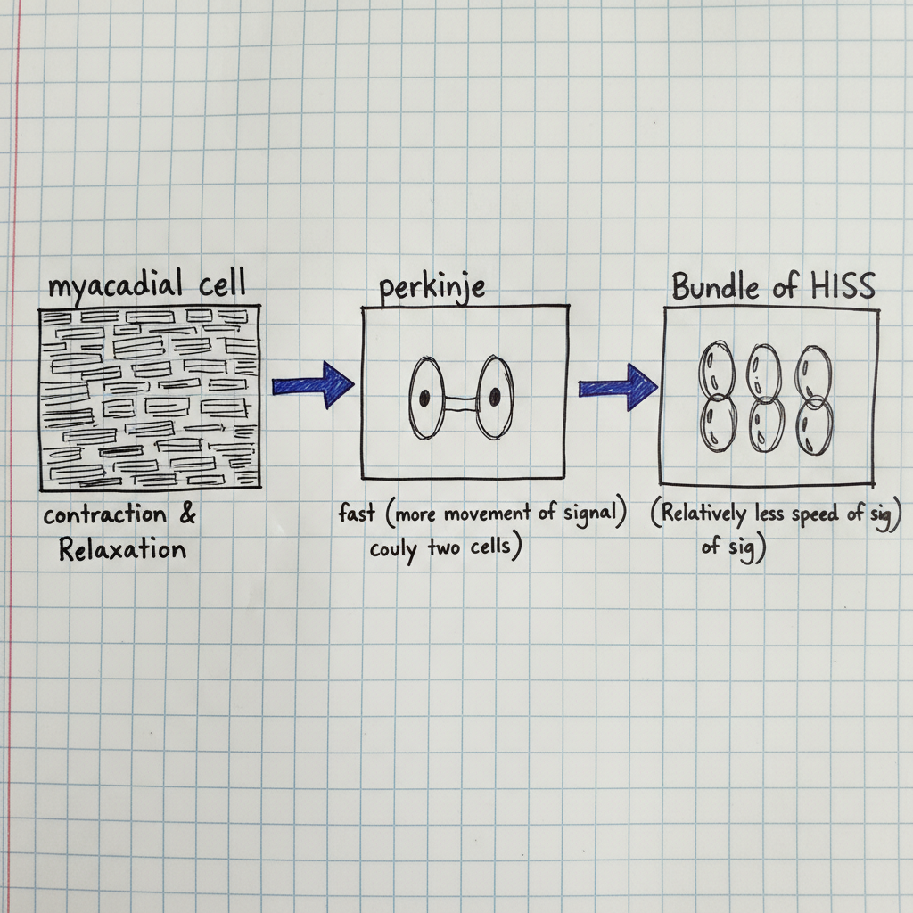
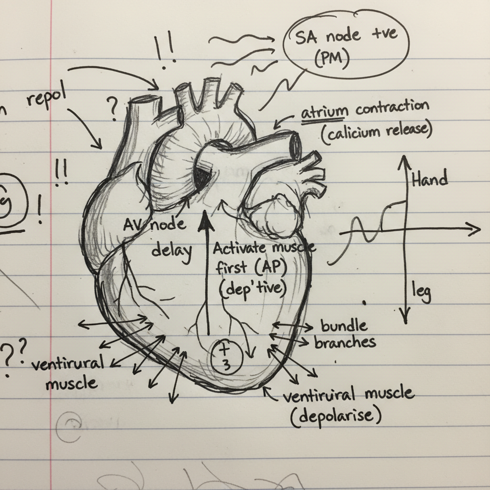

# Cardiac Electrophysiology and ECG Waveform Generation

This document outlines the fundamental principles of the heart's electrical activity, from the cellular level to the generation of an electrocardiogram (ECG). It covers the different types of cardiac cells, the propagation of action potentials, the heart's conduction system, and how these electrical events are represented in an ECG waveform.

## 1. Cardiac Cell Types and Signal Conduction

The speed at which electrical signals travel through the heart varies depending on the type of cardiac cell. This specialization is crucial for the coordinated contraction of the heart chambers.

*   **Myocardial Cells:** These are the primary muscle cells of the atria and ventricles, responsible for `contraction and relaxation`. They are arranged in a layered, interconnected structure that allows the electrical signal to spread steadily, ensuring a unified contraction.
*   **Purkinje Fibers:** These are specialized cells found in the inner ventricular walls. They are designed for very `fast signal conduction` to ensure that all parts of the ventricles contract almost simultaneously. Their structure allows for rapid movement of the electrical signal.
*   **Bundle of His:** This bundle of fibers transmits impulses from the atrioventricular (AV) node to the ventricles. The signal speed here is `relatively slower` compared to the Purkinje fibers, which is part of the heart's intricate timing system.

## 2. The Action Potential and Potential Vector

The contraction of cardiac muscle is triggered by an electrical impulse known as an action potential. This is a rapid change in the electrical potential across the cell membrane.

*   **Resting State:** In a resting state, myocardial cells are polarized, with a positive charge on the outside and a negative charge on the inside.
*   **Depolarization:** When an action potential arrives, it acts like a 'gate switch', causing ion channels to open and reversing this polarity (negative outside, positive inside). 
*   **Potential Vector:** This moving wave of depolarization creates an electrical field, which can be represented by a **potential vector**. This vector points in the direction of the wave's propagation and is the fundamental electrical signal detected by an ECG.

## 3. The Heart's Electrical Conduction System

The heart has a specialized conduction system that coordinates the heartbeat, ensuring the atria contract before the ventricles.

1.  **Sinoatrial (SA) Node:** Known as the heart's natural **pacemaker (PM)**, the SA node initiates the electrical impulse.
2.  **Atrial Contraction:** The impulse spreads across the atria, causing them to depolarize and contract, pushing blood into the ventricles.
3.  **Atrioventricular (AV) Node:** The impulse reaches the AV node, where there is a crucial **delay**. This delay allows the ventricles to fill completely with blood before they contract.
4.  **Ventricular Depolarization:** After the delay, the signal travels rapidly down the intraventricular septum (via the Bundle of His) and then throughout the ventricular muscle via the Purkinje fibers. This causes the ventricles to depolarize and contract forcefully.
5.  **Repolarization:** Following contraction, the heart muscle cells return to their resting, polarized state in a process called repolarization, preparing for the next heartbeat.

## 4. The Electrocardiogram (ECG) Waveform

An ECG records the heart's electrical activity using electrodes placed on the skin. The resulting waveform corresponds directly to the events of the cardiac conduction cycle.

*   **P Wave:** Represents the depolarization and **contraction of the atria**.
*   **QRS Complex:** Represents the **depolarization of the ventricles**. 
    *   The **Q wave** (initial downward deflection) often corresponds to the depolarization of the intraventricular septum.
    *   The **R wave** (large upward spike) represents the depolarization of the main mass of the ventricular muscle.
    *   The **S wave** is the final depolarization of the ventricles, near the base.
*   **Amplitude:** The QRS complex is much larger in voltage (amplitude) than the P wave because the ventricles have a significantly **more muscle mass (more cells)** than the atria, generating a stronger electrical signal.
*   **T Wave:** Represents the **repolarization of the ventricles**.

## 5. Summary of Heart Function

The electrical conduction system ensures the efficient mechanical pumping of the heart:
*   **Right Ventricle:** Pumps deoxygenated blood to the **lungs**.
*   **Left Ventricle:** Pumps oxygenated blood to all other **body parts**.

---

