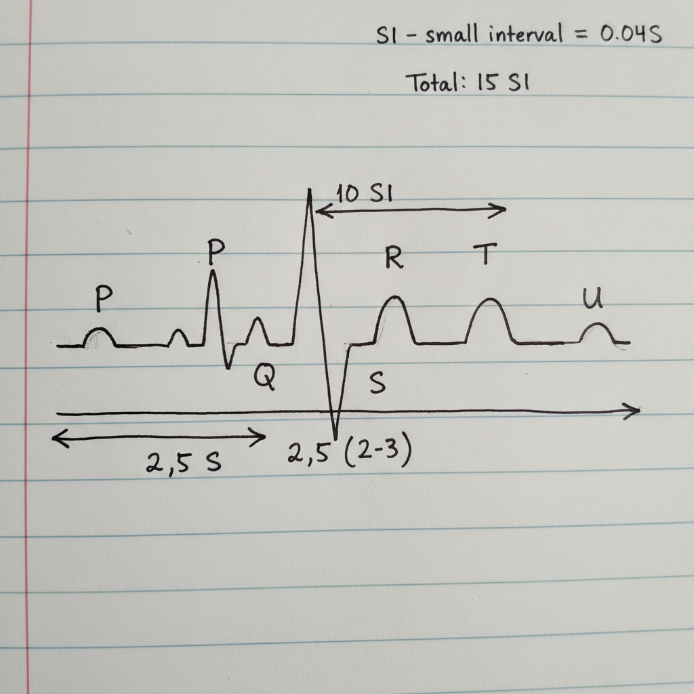

# Signal Processing for Biomedical Analysis

This document outlines the fundamental concepts of signal processing, with a specific focus on its application in biomedical signal analysis, such as interpreting an Electrocardiogram (ECG).

## Core Methods of Signal Analysis

Biomedical signals can be analyzed using two primary methods: Temporal Analysis and Frequency Analysis.

### 1. Temporal Analysis

Temporal analysis involves examining the characteristics of a signal with respect to time. This includes measuring its duration, amplitude, and the time intervals between specific events. It answers the question, "What is happening with the signal at a particular moment in time?"

**Examples:**
*   **CT Scan (Digital Image Processing):** Analyzing the intensity of pixels over a spatial domain, which is analogous to the time domain.
*   **ECG Signal Analysis:** Identifying abnormalities by measuring the duration of different waves and intervals, such as a slow T-wave.

#### Example: Calculating Heart Rate from an ECG

The signal from the central nervous system triggers the Sinoatrial (SA) node in the heart, creating a pulse that can be measured on an ECG. By analyzing the time duration of one complete pulse, we can calculate the heart rate.

**Calculation from Notes:**
1.  **Define a unit:** The signal is divided into 'Small Intervals' (SI), where `1 SI = 0.04 seconds`.
2.  **Measure pulse duration:** One complete heartbeat or pulse is measured to be `17 SI` long.
3.  **Calculate duration in seconds:** `Pulse Duration = 17 SI * 0.04 s/SI = 0.68 seconds`.
4.  **Calculate pulses per minute (Heart Rate):** `Heart Rate = (60 seconds / 1 minute) / (0.68 seconds / pulse) ≈ 88 pulses/minute`.

This calculation is a direct application of temporal analysis, where the time duration of a signal event is used to derive a meaningful physiological parameter.

### 2. Frequency Analysis

Frequency analysis involves decomposing a signal into its constituent frequencies. This method helps in identifying periodic components within the signal and is particularly useful for separating the desired information from unwanted noise.

The diagram above illustrates this concept. A larger signal segment (e.g., 15 seconds) is shown as a grid. By 'zooming in' on a very small portion (e.g., 0.2 seconds), we can analyze its high-frequency components. This allows us to filter out noise, which often resides in different frequency bands than the primary information-carrying part of the signal.

#### Alternative Calculation Example:

The notes also show a simplified calculation for determining pulses per minute:
*   If pulse duration is exactly `0.6 seconds`.
*   `Pulses per minute = 60 seconds / 0.6 seconds/pulse = 100 pulses/minute`.

## Introduction to Digital Signal Processing (DSP)

DSP involves using computers to perform signal processing operations. The typical workflow includes three main stages:

1.  **Signal Acquisition:** Capturing the raw analog signal (e.g., using electrodes for an ECG) and converting it into a digital format.
2.  **Signal Analysis:** Applying techniques like temporal and frequency analysis to the digital signal to extract meaningful data.
3.  **Signal Processing:** Manipulating the signal, for instance, by filtering out noise or enhancing specific features.

## The Nature of Signals

A signal is fundamentally a function that **carries information**. Electrical signals, like those in the human body, can often be modeled as combinations of simple waveforms.

A basic periodic signal can be represented by the sine wave equation:

`e(t) = A * sin(2πft)`

Where:
*   `e(t)` is the value of the signal at time `t`.
*   `A` is the amplitude (maximum intensity).
*   `f` is the frequency of the signal.
*   `t` is time.

The ECG is a representation of the heart's electrical activity—a complex biomedical signal that can be understood through these processing principles.

---

