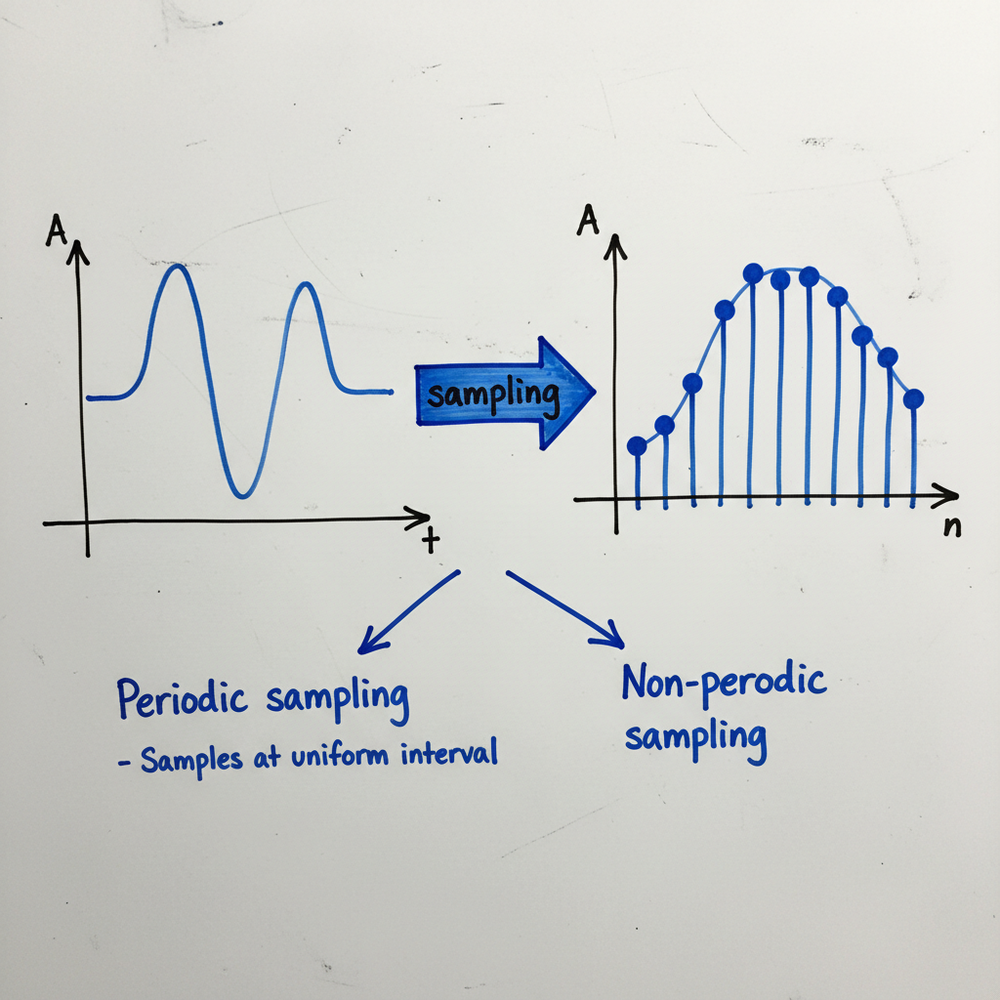

# Signal Acquisition

Signal acquisition is the process of collecting real-world physical signals and converting them into a digital format that can be processed by a computer. This is a fundamental step in digital signal processing (DSP), particularly in fields like biomedical engineering.

## 1. Data Collection and Sampling

The first step is to collect the raw analog signal. In this example, the signal is an Electrocardiogram (ECG), which measures the electrical activity of the heart.

Once the continuous analog signal is acquired, it must be converted into a discrete signal through a process called **sampling**. Sampling involves measuring the amplitude of the analog signal at discrete points in time.

### Types of Sampling

There are two primary approaches to sampling:

*   **Periodic Sampling:** This is the most common method, where samples are taken at uniform, regular time intervals. The time between consecutive samples is known as the sampling period (T_s).
*   **Non-periodic Sampling:** In this less common approach, the time intervals between samples are not uniform. This can be useful in specific applications where the signal's characteristics change over time.

## 2. Determining the Sampling Rate

A critical question in signal acquisition is how often to sample the signal. The choice of sampling rate depends heavily on the frequency content of the signal itself.

### Frequency Ranges of Common Biomedical Signals

Different signals occupy different frequency bands. For instance:

*   **ECG Signal:** The significant frequency components typically lie in the range of **0-100 Hz**. For high-fidelity clinical applications, a range up to **0-150 Hz** is often considered.
*   **EEG (Electroencephalogram) Signal:** The frequency range is approximately **0-100 Hz**.

### The Sampling Dilemma

Choosing the right sampling rate involves a trade-off:
*   **Too few samples (low sampling rate):** Important information from the original signal can be lost (a phenomenon known as aliasing).
*   **Too many samples (high sampling rate):** While this captures the signal with high fidelity, it results in a large amount of data, which requires more storage space and computational power to process.

The key challenge is finding the optimal solution: a sampling rate that faithfully represents the original signal without generating excessive data.

## The Nyquist-Shannon Sampling Theorem

The solution to this dilemma is provided by the **Nyquist-Shannon Sampling Theorem**. This fundamental theorem of signal processing states:

> To perfectly reconstruct an analog signal from its samples, the sampling frequency (`f_s`) must be at least twice the maximum frequency (`f_max`) present in the signal.

Mathematically, this is expressed as:
`f_s >= 2 * f_max`

The minimum required sampling rate (`2 * f_max`) is known as the **Nyquist rate**. For an ECG signal with a maximum frequency of 150 Hz, the minimum sampling rate would be `2 * 150 Hz = 300 Hz`.

---

