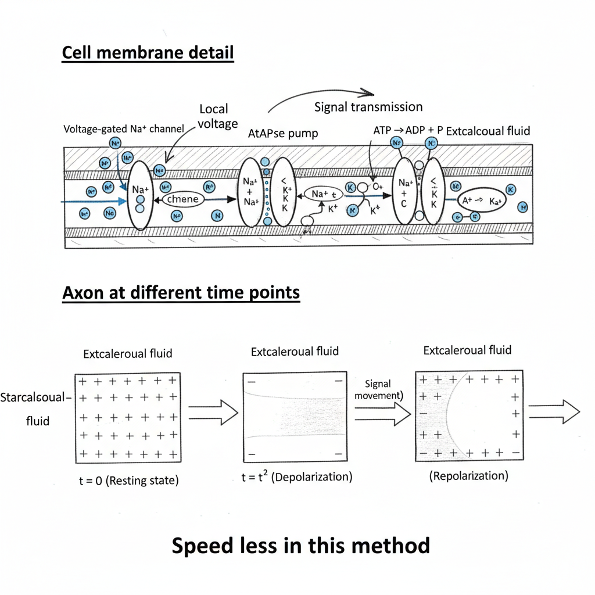

# Neurophysiology: Ion Channels and Signal Transmission

This document covers the fundamental principles of neuronal signal transmission, focusing on the behavior of voltage-sensitive sodium channels and comparing two methods of signal propagation along an axon.

## 1. Voltage-Sensitive Na+ Channel

Voltage-sensitive (or voltage-gated) sodium (Na+) channels are integral membrane proteins that are crucial for initiating and propagating action potentials in neurons and other excitable cells. Their function is to allow Na+ ions to rapidly flow into the cell, causing depolarization. These channels can exist in three main conformational states.

### States of the Na+ Channel

1.  **Resting State (Closed but capable of opening):** In this state, the channel is closed, but it is ready to open in response to a sufficient voltage change (depolarization). This is the state of the channel at the neuron's resting membrane potential.
2.  **Active State (Open):** Upon reaching a threshold voltage, the channel rapidly changes conformation and opens. This allows a massive influx of Na+ ions into the cell, down their electrochemical gradient, leading to the rapid upstroke of the action potential.
3.  **Inactive State (Closed and not capable of opening):** Shortly after opening, the channel spontaneously closes again, but into an inactivated state. In this state, an 'inactivation gate' blocks the pore. The channel cannot be opened by further depolarization until the membrane potential returns to its resting state, which allows the inactivation gate to reopen and the channel to return to the resting state. This mechanism is responsible for the **absolute refractory period**.

### Timeline of Channel States During an Action Potential

*   `t0 - t1`: **Resting State**. The neuron is at its resting potential, and the Na+ channels are closed.
*   `t1 - t2`: **Active State**. A stimulus causes the membrane to depolarize to threshold, causing Na+ channels to open. Na+ rushes in, causing the rapid depolarization phase of the action potential.
*   `t2 - t3`: **Inactive State**. The Na+ channels inactivate. During this time, voltage-gated Potassium (K+) channels are typically open (`t2 - t4`), allowing K+ to exit the cell, which causes the repolarization of the membrane.
*   `t3 - t4`: **Return to Resting State**. As the membrane repolarizes and returns to its resting potential, the Na+ channels transition from the inactive state back to the closed, resting state, ready for the next action potential.

## 2. Signal Transmission Methods

Signal transmission, or action potential propagation, occurs via two primary methods depending on whether the axon is myelinated or not.

### Method I: Continuous Conduction (Unmyelinated Axons)

This method occurs in axons that lack a myelin sheath. The action potential propagates as a continuous wave along the entire length of the axon.

**Process:**
1.  An initial stimulus causes a localized depolarization, opening voltage-gated Na+ channels.
2.  The influx of Na+ at this point creates a 'local voltage' change that depolarizes the adjacent segment of the membrane to its threshold.
3.  This triggers the opening of Na+ channels in that adjacent segment, regenerating the action potential. Meanwhile, the previous segment begins to repolarize as K+ channels open and Na+ channels inactivate.
4.  This chain reaction continues step-by-step along the entire axon membrane.

**Key Characteristic:**
*   **Slower Speed:** As the note indicates, this method is relatively slow because the action potential must be regenerated at every single point along the membrane. The Na+/K+ ATPase pump works continuously to restore the ion gradients after the action potential has passed.

### Method II: Saltatory Conduction (Myelinated Axons)

This is a much faster method of signal propagation that occurs in myelinated axons.

**Process:**
1.  The axon is wrapped in a **myelin sheath**, an insulating layer that is a poor electrical conductor.
2.  This sheath is interrupted at regular intervals by gaps called **Nodes of Ranvier**, where the voltage-gated Na+ and K+ channels are concentrated.
3.  An action potential is generated at one node (e.g., triggered by a pressure-sensitive Na+ channel in a sensory neuron).
4.  The influx of Na+ ions does not trigger adjacent channels immediately. Instead, the ions diffuse rapidly through the cytoplasm under the insulating myelin sheath to the next Node of Ranvier.
5.  This diffusion of charge depolarizes the next node to its threshold, triggering a new action potential.

**Key Characteristic:**
*   **Faster Speed:** The action potential appears to 'jump' from node to node, hence the name 'saltatory' (from the Latin *saltare*, to leap). This is much faster and more energy-efficient than continuous conduction.

## 3. Refractory Period

The **refractory period** is a brief period of time following an action potential during which it is more difficult or impossible for the neuron to generate another action potential.

*   **Absolute Refractory Period:** This corresponds to the time when the voltage-gated Na+ channels are in their **inactive state**. No matter how strong the stimulus, a new action potential cannot be generated. This ensures the one-way propagation of the nerve impulse and limits the maximum firing rate of the neuron.

---

