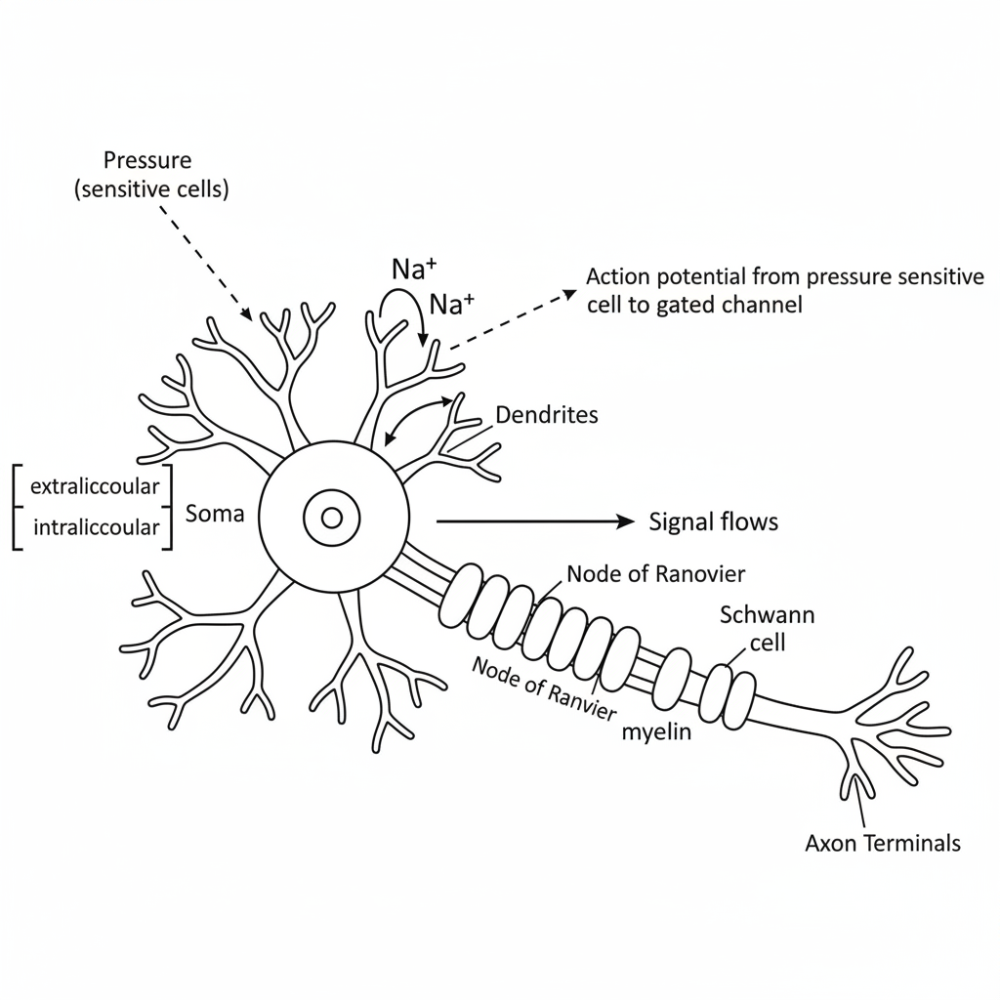

# Neuronal Signaling: Action Potentials and Synaptic Transmission

This document outlines the fundamental processes of neural communication, covering the generation of an action potential within a single neuron and the transmission of that signal to another neuron across a synapse.

## 1. The Action Potential (AP)

An **Action Potential** is a rapid, temporary change in the electrical potential across the membrane of an excitable cell, such as a neuron. It functions as a moving wave of electrical activity, formally described as a wave of **depolarization** followed by **repolarization** that propagates along the cell membrane.

### Structure of a Neuron

Neurons are the primary cells of the nervous system. An action potential is initiated at one end and travels down the length of the neuron to transmit a signal.

Key components of a neuron include:

*   **Soma (Cell Body):** Contains the **nucleus** and is the main metabolic center of the neuron.
*   **Dendrites:** Tree-like extensions that receive signals from other neurons.
*   **Axon:** A long, slender projection that conducts electrical impulses away from the soma.
*   **Myelin Sheath:** A fatty insulating layer that covers the axon, formed by **Schwann Cells**. It significantly increases the speed of signal transmission.
*   **Nodes of Ranvier:** Gaps in the myelin sheath where the action potential is regenerated.
*   **Axon Terminal:** The end of the axon, where the signal is passed to the next cell.

### Generation and Propagation of an Action Potential

The process begins when a stimulus (e.g., pressure on a sensitive cell) causes specific ion channels in the neuron's membrane to open. This allows an influx of positive ions (like `Na+`), raising the membrane potential. If this potential reaches a certain **threshold**, a full-scale action potential is triggered, which then travels down the axon.

### Conduction Speed

The speed at which an action potential travels depends on whether the axon is myelinated.

*   **Myelinated Neuron:** The signal jumps from one Node of Ranvier to the next (a process called saltatory conduction), resulting in very fast transmission speeds of approximately **100 m/sec**.
*   **Non-myelinated Neuron:** The signal must propagate continuously along the entire axon membrane, which is much slower, around **0.25 m/sec**.

## 2. Transmission of the Signal (Synaptic Transmission)

For a signal to travel through the nervous system, it must be passed from one neuron to the next, or from a neuron to a target cell like a muscle fiber (at a **neuromuscular joint**). This transfer occurs at a specialized junction called a **synapse**.

### The Chemical Synapse

The process of transmitting an action potential across a chemical synapse involves converting the electrical signal into a chemical one and then back into an electrical signal.

The key steps are as follows:

1.  **Arrival of AP:** The action potential arrives at the axon terminal of the **presynaptic (1st) neuron**.
2.  **Calcium Influx:** The change in voltage opens **voltage-gated calcium channels**, allowing `Ca²⁺` ions to flow into the terminal.
3.  **Neurotransmitter Release:** The influx of `Ca²⁺` triggers proteins like **Syntaxin** (a calcium-sensitive protein) to cause vesicles filled with neurotransmitters (e.g., **Acetylcholine**) to fuse with the presynaptic membrane. The neurotransmitters are then released into the **synaptic cleft** (the space between the neurons).
4.  **Receptor Binding:** Neurotransmitters diffuse across the cleft and bind to **ligand-gated ion channels** on the membrane of the **postsynaptic (2nd) neuron**.
5.  **Postsynaptic Potential:** This binding opens the channels, allowing ions like `Na⁺` to flow into the postsynaptic neuron. This influx of positive charge creates a new electrical potential. If this potential is strong enough to reach the threshold, it will trigger a new action potential in the second neuron.

This entire process effectively converts the electrical **Action Potential** into a **Chemical Signal** (neurotransmitter) to cross the synapse, and then back into an electrical signal.

### The Action Potential Waveform

The change in membrane potential during an action potential follows a characteristic pattern when plotted against time.

The phases shown in the graph are:

*   **Resting Membrane Potential (RMP):** The baseline, negative charge of the neuron at rest.
*   **Threshold:** The minimum potential that must be reached to trigger an action potential.
*   **Depolarization (Rising Phase):** A rapid increase in potential due to the influx of `Na⁺` ions.
*   **Repolarization (Falling Phase):** A rapid decrease in potential as `K⁺` ions exit the cell.
*   **Hyperpolarization:** A brief period where the potential drops below the RMP.

The entire event is very brief, typically lasting only a few milliseconds (e.g., ~5 ms).

---

