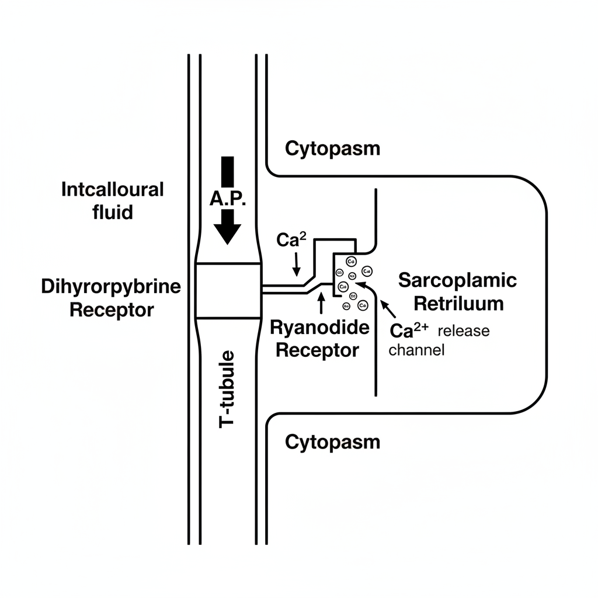

# Mechanism of Signal Transmission in Excitable Cells

Excitable cells, such as neurons and muscle cells, have the ability to generate and propagate electrical signals called action potentials. The transmission of these signals between cells is fundamental for processes like thought, movement, and heartbeat. This document outlines the three primary mechanisms of signal transmission between these cells.

## 1. Transmission Between Two Neurons (Chemical Synapse)

This is the most common type of synapse in the nervous system. It involves the conversion of an electrical signal (action potential) in the first neuron into a chemical signal (neurotransmitter release), which then generates an electrical signal in the second neuron. This junction is also referred to as a nerve cell joint.

### Sequence of Events:
1.  **Arrival of Action Potential:** An action potential travels down the axon of the presynaptic (first) neuron and reaches the nerve ending, also known as the axon terminal.
2.  **Calcium Influx:** The depolarization from the action potential opens voltage-gated calcium (Ca²⁺) channels. Ca²⁺ ions flow from the extracellular space into the presynaptic terminal.
3.  **Vesicle Fusion and Neurotransmitter Release:** The influx of Ca²⁺ triggers the fusion of synaptic vesicles with the presynaptic membrane. This process is mediated by SNARE proteins, such as **Syntaxin** on the presynaptic membrane and **Synaptobrevin** on the vesicle membrane. These vesicles contain chemical messengers called neurotransmitters (in this case, **Acetylcholine**).
4.  **Diffusion Across Synaptic Cleft:** The neurotransmitter is released into the synaptic cleft, a small gap (~70 nm) between the two neurons, and diffuses across it.
5.  **Binding to Postsynaptic Receptors:** The neurotransmitter binds to specific receptor proteins on the postsynaptic membrane of the second neuron (the dendrite). The example shows a **Nicotinic Acetylcholine Receptor**, which is a type of ligand-gated ion channel and is a pentameric protein (composed of five subunits).
6.  **Postsynaptic Potential Generation:** Binding of acetylcholine opens the ion channel, allowing sodium ions (Na⁺) to flow into the postsynaptic neuron. This influx of positive charge causes a localized depolarization called an excitatory postsynaptic potential (EPSP). If this potential is strong enough to reach the threshold, it will trigger a new action potential in the second neuron.

## 2. Transmission Between a Motor Neuron and Skeletal Muscle (Neuromuscular Junction)

This is a specialized chemical synapse where a motor neuron communicates with a skeletal muscle fiber, causing it to contract. This process is known as Excitation-Contraction (E-C) coupling. The postsynaptic membrane on the muscle cell is called the **motor end plate**.

### Sequence of Events:
1.  **Action Potential Propagation:** An action potential generated at the motor end plate travels along the muscle cell's membrane (sarcolemma) and down into invaginations called **T-tubules**.
2.  **Voltage Sensing:** The depolarization is detected by the **Dihydropyridine Receptor (DHPR)**, a voltage-sensitive protein located in the T-tubule membrane.
3.  **Calcium Release:** In skeletal muscle, the DHPR is mechanically coupled to the **Ryanodine Receptor (RyR)**, which is a Ca²⁺ release channel located on the membrane of the **Sarcoplasmic Reticulum** (SR), a specialized organelle that stores high concentrations of calcium.
4.  **Initiation of Contraction:** The activation of the DHPR physically pulls open the RyR channel, allowing a massive amount of Ca²⁺ to flood from the SR into the cytoplasm. This increase in cytoplasmic Ca²⁺ initiates the process of muscle contraction.

## 3. Transmission Between Two Muscle Cells (Electrical Synapse)

This type of transmission is characteristic of cardiac muscle and some types of smooth muscle. It allows for rapid and synchronized contraction of an entire muscle tissue mass. It relies on direct electrical coupling between cells rather than chemical messengers.

### Mechanism:
*   **Gap Junctions:** Adjacent muscle cells (**myocytes**) are physically connected by protein channels called **gap junctions**. These junctions form pores that allow the cytoplasm of the two cells to be continuous.
*   **Direct Ion Flow:** When an action potential occurs in one cell, ions (like Na⁺) that rush into the cell can flow directly into the adjacent cell through the gap junctions.
*   **Signal Propagation:** This direct flow of current depolarizes the neighboring cell to its threshold, causing it to fire an action potential as well. This process repeats, allowing the wave of excitation to spread rapidly and uniformly throughout the tissue, ensuring a coordinated contraction.

---

