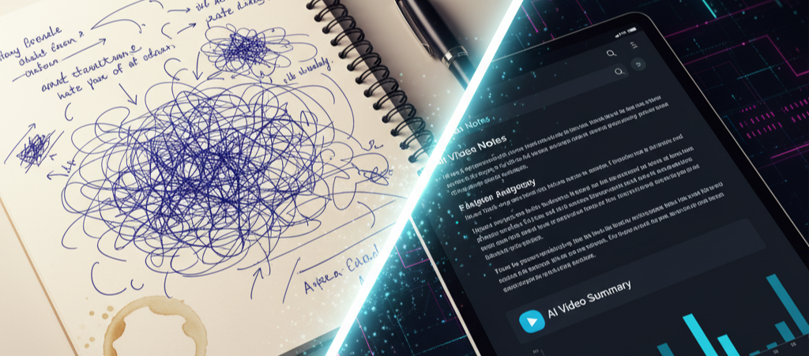
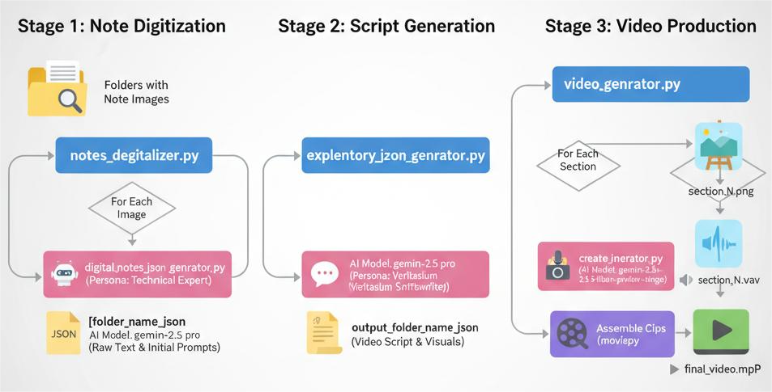
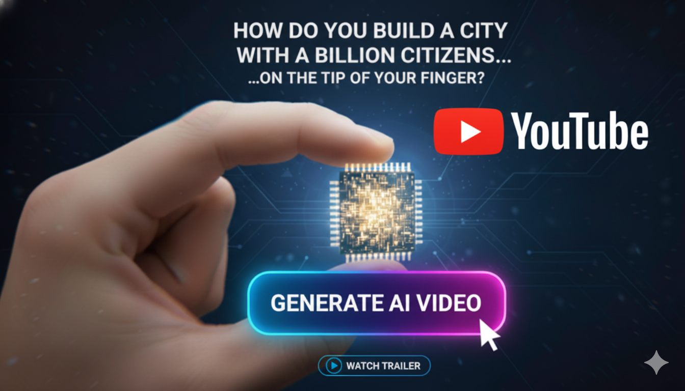

# NotionNarrator Documentation
<div style="width: 100%;">

  <h2 style="font-size: 24px; font-weight: 600;">Project Overview</h2>

  

  <p style="font-size: 16px; line-height: 1.5;">
    NotionNarrator is an AI-powered documentation generator that transforms handwritten or typed notes from images into structured educational content. The system operates in two distinct modes:

1.  **Documentation Generation Mode**: Converts note images into formatted Markdown documents with AI-generated illustrations
2.  **Video Generation Mode**: Creates educational video slideshows with AI-generated images and narration
  </p>

</div>


## Technical Pipeline Flow



The NotionNarrator system implements a three-stage pipeline architecture that progressively transforms raw note images into polished educational video content. Each stage operates independently with well-defined inputs and outputs, enabling modular processing and parallel execution where applicable.


## Architecture Overview

[](https://www.youtube.com/watch?v=5aftMJ3UpKo&list=PLTkDyGbgSTQpe0X5DKmxNjy7mdX78kTo4)

<p align="center">
  <strong><a href="https://www.youtube.com/watch?v=5aftMJ3UpKo&list=PLTkDyGbgSTQpe0X5DKmxNjy7mdX78kTo4">
    Click here to watch the full demo video
  </a></strong>
</p>

The project follows a modular pipeline architecture where each component handles a specific stage of content generation. The system leverages Google's Gemini API for all AI operations including vision, language generation, image synthesis, and text-to-speech.
### Core Components

**agent/digital_notes_json_genrator.py**
- Primary vision-to-text conversion module
- Uses Gemini 2.5 Pro with extended thinking budget (30,000 tokens)
- Analyzes note images and extracts structured information
- Outputs JSON containing markdown-formatted descriptions and image generation prompts
- Implements strict JSON schema validation for consistent output structure

**agent/notes_degitalizer.py**
- Folder-level orchestration for documentation generation
- Processes multiple images per folder and combines results
- Aggregates descriptions and image prompts into unified JSON files
- Maintains folder hierarchy in output structure

**agent/explentory_json_genrator.py**
- Content enhancement and narrative generation
- Uses Gemini 2.5 Pro with extended thinking budget (32,768 tokens)
- Transforms fragmented technical notes into cohesive educational scripts
- Implements Veritasium-style narrative structure for engaging content
- Converts basic image prompts into detailed, production-ready descriptions
- Outputs sections array with paired image descriptions and narration content

**agent/create_image.py**
- Image synthesis module
- Uses Gemini 2.5 Flash Image model for visual generation
- Converts text descriptions into educational diagrams and illustrations
- Supports streaming generation for efficient processing
- Handles binary file operations for image storage

**agent/voice_genrator.py**
- Text-to-speech conversion module
- Uses Gemini 2.5 Flash Preview TTS with Kore voice configuration
- Generates natural-sounding educational narration
- Handles audio format conversion to WAV
- Implements MIME type parsing and WAV header generation

**agent/video_genrator.py**
- Video assembly and rendering pipeline
- Orchestrates parallel generation of images and audio
- Uses ThreadPoolExecutor for concurrent asset generation
- Leverages MoviePy for video composition
- Creates synchronized slideshows with H.264 video and AAC audio encoding
- Implements asset caching to avoid redundant generation

## Processing Workflows

### Documentation Generation Pipeline

1. Image ingestion from folder structure
2. Vision analysis using Gemini 2.5 Pro
3. JSON extraction with markdown content and image prompts
4. Aggregation of multi-image folder content
5. Optional image generation from prompts
6. Markdown file assembly with embedded references

### Video Generation Pipeline

1. JSON input containing sections with image descriptions and narration text
2. Parallel asset generation:
   - Image synthesis from enhanced descriptions
   - Audio generation from narration content
3. Asset validation and caching
4. Video clip creation with synchronized audio
5. Clip concatenation and final video rendering
6. Export with optimized encoding settings

## AI Models and Configuration

**Vision and Language Processing**
- Model: Gemini 2.5 Pro
- Configuration: Extended thinking budgets for complex reasoning
- Response format: Structured JSON with schema validation
- Temperature: Default for consistent outputs

**Image Generation**
- Model: Gemini 2.5 Flash Image
- Output: PNG format with streaming delivery
- Style: Educational infographic and technical illustration
- Modalities: Image and text generation

**Text-to-Speech**
- Model: Gemini 2.5 Flash Preview TTS
- Voice: Kore (prebuilt voice configuration)
- Temperature: 1.0 for natural variation
- Format: PCM audio converted to WAV

## Data Flow and Output Structure

### Documentation Mode Output
```
vlsi/
├── 1/
│   ├── 1.json                  # Combined input descriptions and prompts
│   ├── 1.png                   # Source note image
│   └── 2.png                   # Additional source images
├── 2/
│   └── 2.json
└── ...
```

JSON structure for documentation:
```json
{
  "folder": "1",
  "total_images": 2,
  "processed_images": 2,
  "descriptions": [
    {
      "image": "1.png",
      "description": "# Markdown formatted content..."
    }
  ],
  "image_prompts": [
    "Detailed image generation prompt..."
  ]
}
```

### Video Mode Output
```
vlsi/video/
├── 1.json                      # Input script with sections
├── output_1/
│   ├── images/
│   │   ├── section_0.png      # Generated section images
│   │   └── section_1.png
│   ├── audio/
│   │   ├── section_0.wav      # Generated narration audio
│   │   └── section_1.wav
│   └── final_video.mp4        # Rendered video output
├── 2.json
├── output_2/
│   └── final_video.mp4
└── ...
```

JSON structure for video generation:
```json
{
  "sections": [
    {
      "image_description": "Detailed prompt for image generation with style, composition, labels",
      "content": "Narration script in conversational, educational tone"
    }
  ]
}
```

## Performance Optimizations

**Parallel Processing**
- Concurrent image and audio generation per section
- Configurable worker pools for multi-video processing
- ThreadPoolExecutor for I/O-bound operations

**Asset Caching**
- Checks for existing images and audio before generation
- Prevents redundant API calls and processing
- Maintains generated assets for incremental updates

**Streaming Operations**
- Chunked response handling for image generation
- Efficient memory usage for large binary data
- Progressive file writing for immediate availability

## System Requirements

**Python Environment**
- Python 3.13 or compatible version
- Core dependencies: google-genai, python-dotenv, moviepy, pillow

**API Configuration**
- Google Gemini API key required
- Set via environment variable: GEMINI_API_KEY
- Alternative: .env file in project root

**Resource Considerations**
- Video rendering requires adequate disk space
- Parallel processing scales with available CPU cores
- Network bandwidth for API communication

## Error Handling and Resilience

**JSON Parsing**
- Multiple parsing strategies for malformed responses
- Markdown code block removal
- Fallback to text extraction from nested structures

**Asset Generation Failures**
- Graceful degradation when individual sections fail
- Detailed logging for debugging
- Continuation of pipeline despite partial failures

**API Error Management**
- Exception catching at component level
- Retry logic through asset caching mechanism
- Clear error reporting for user intervention

## Extension Points

**Model Customization**
- System prompts configurable per generation type
- Schema definitions for structured output control
- Temperature and thinking budget adjustments

**Output Formats**
- Pluggable video codecs and quality settings
- Alternative audio formats beyond WAV
- Custom image styles through prompt engineering

**Processing Workflows**
- Modular component design for pipeline modification
- Hook points for pre/post-processing
- Configurable parallel processing parameters