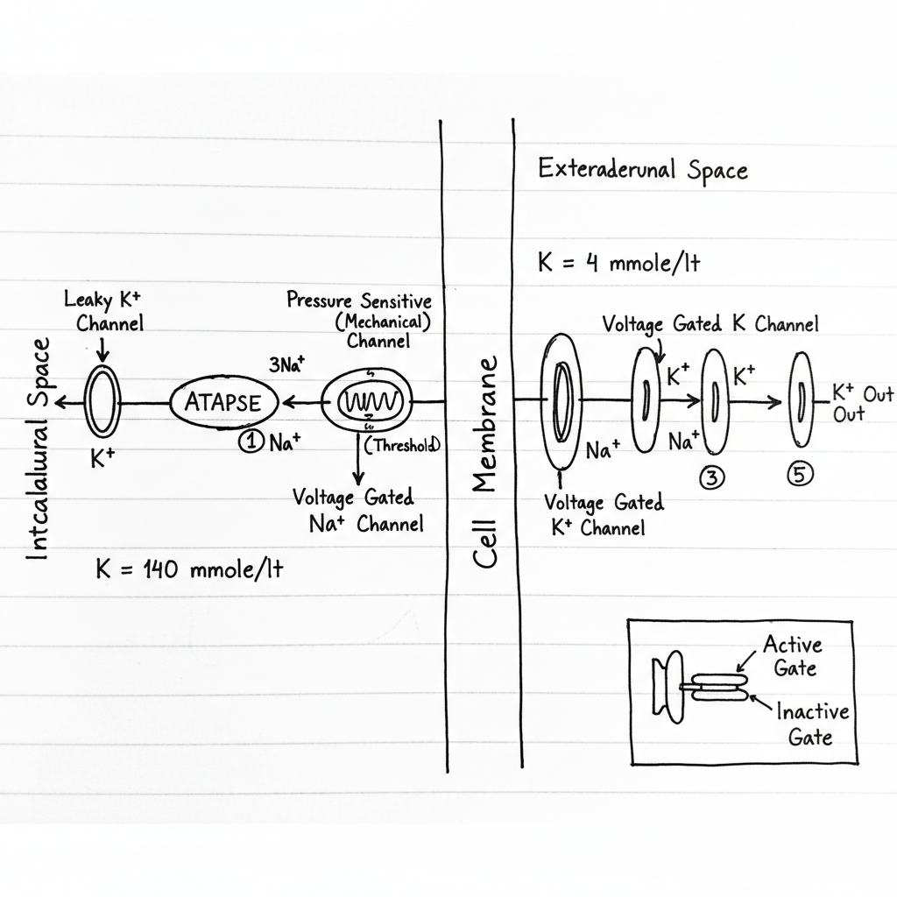
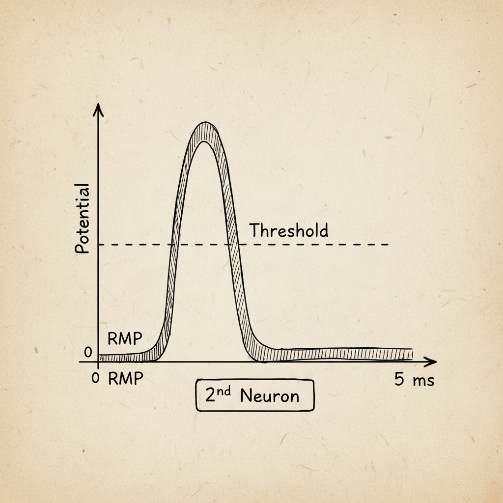

# Biomedical Signal Processing: Resting Potential

## 1. Key Definitions

*   **Resting Potential:** The electrical charge difference across the plasma membrane of a cell when it is in a non-excited state, or at rest. It is the charge associated with a resting cell.
*   **Action Potential:** A rapid, temporary change in the membrane potential of a cell, which is used for communication between cells, such as neurons and muscle cells.

## 2. The Cellular Environment

The resting potential is established by the interaction between the cell's membrane, various ion channels, and the differing ion concentrations inside and outside the cell.

### Components:

*   **Cell Membrane:** A lipid bilayer that separates the intracellular fluid from the extracellular fluid. It is selectively permeable to ions.
*   **Intracellular Fluid (ICF):** The fluid within the cell. It has a high concentration of potassium (K+) ions and low concentration of sodium (Na+) ions.
*   **Extracellular Fluid (ECF):** The fluid outside the cell. It has a high concentration of Na+, Chloride (Cl-), and Calcium (Ca2+) ions, and a low concentration of K+ ions.
*   **Ion Channels & Pumps:**
    *   **Leaky K+ Channel:** An uncontrolled, passive channel that is always open, allowing K+ ions to move across the membrane according to their concentration gradient.
    *   **Voltage-Gated Na+ Channel:** A channel that opens and closes in response to changes in membrane voltage. It is crucial for generating action potentials.
    *   **Sodium-Potassium Pump (Na+/K+ ATPase):** An active transport mechanism that pumps 3 Na+ ions out of the cell for every 2 K+ ions it pumps in. This process requires energy.

## 3. The Role of ATP (Adenosine Triphosphate)

The Na+/K+ pump is powered by ATP, the primary energy currency of the cell.

*   **Hydrolysis:** The pump uses the energy released from the hydrolysis of ATP.
    *   ``ATP + H₂O → ADP + Pᵢ + Energy``
*   **(Note:** The notes state ATP is made in the nucleus. While the nucleus directs protein synthesis, ATP is primarily synthesized in the mitochondria through cellular respiration.)

## 4. Examples of Resting Potential (R.P.) in Different Cells

The resting potential varies depending on the cell type:

*   **Skeletal Muscle:** -90mV
*   **Neuron Cell:** -60mV
*   **Smooth Muscle Cell:** -60mV
*   **Cardiac Cell:** ≈ -50mV to -90mV
*   **Cartilage:** -8mV
*   **Red Blood Cell (RBC):** -8.4mV

## 5. Establishment of the Resting Potential in a Neuron (-60mV)

The resting potential is primarily established by the outward diffusion of K+ ions through leaky K+ channels.

### Step 1: K+ Concentration Gradient
There is a high concentration of K+ inside the cell (e.g., 140 mmole/lt) and a low concentration outside (e.g., 4 mmole/lt). This chemical gradient drives K+ ions to move out of the cell.

### Step 2: K+ Efflux and Charge Separation
As positively charged K+ ions (cations) diffuse out of the cell through the leaky channels, they leave behind a net negative charge inside the cell. This creates an electrical gradient.

### Step 3: Electrochemical Equilibrium

The outward movement of K+ ions makes the inside of the cell progressively more negative (e.g., -5mV, -10mV...). This internal negativity creates an electrical force that pulls the positive K+ ions back into the cell.

The efflux of K+ continues until the outward force from the concentration gradient is perfectly balanced by the inward electrical force. This point of equilibrium is the **resting membrane potential**. For a neuron, this value is approximately **-60mV**.

---

---

# Ion Channels and Cellular Membrane Potentials

This document outlines the fundamental principles governing ion movement across a cell membrane, focusing on voltage-gated sodium channels, electrochemical gradients, and the equilibrium potentials of key ions. These concepts are crucial in fields like neurobiology and biomedical engineering for understanding nerve impulses and cellular communication.

## 1. Voltage-Gated Sodium (Na⁺) Channels

A **Voltage-Gated Sodium Channel** is a type of transmembrane protein that forms an ion channel pore, allowing sodium ions (Na⁺) to pass through the cell membrane. As the name implies, the channel's permeability to Na⁺ is regulated by the membrane potential (voltage) across it.

These channels play a critical role in the initiation and propagation of action potentials in excitable cells like neurons. The notes indicate a key feature: the gate is **closed** when the membrane potential is below a certain threshold, such as at a resting potential of -60mV.

The diagram also depicts the **Na⁺/K⁺-ATPase pump**, an active transport mechanism that uses ATP to move sodium ions out of the cell against their concentration gradient. This pump is essential for maintaining the low intracellular Na⁺ concentration required for the electrochemical gradient.

## 2. Electrochemical Gradients

The movement of an ion across a membrane is governed by its **electrochemical gradient**, which is the sum of two distinct forces:

*   **Concentration Gradient:** The force driving ions to move from an area of higher concentration to an area of lower concentration.
*   **Electrical Gradient (Membrane Potential):** The force exerted on an ion due to the difference in electrical charge across the membrane. Positively charged ions (cations) are attracted to the negatively charged side of the membrane, and vice-versa for anions.

The net driving force, or **Electrochemical Force (ECF)**, determines the direction and magnitude of ion flow when a channel is open.

For sodium (Na⁺), both the concentration gradient (much higher outside the cell) and the electrical gradient (negative inside the cell) typically push it into the cell, creating a strong inward electrochemical force.

## 3. Typical Ion Concentrations and Equilibrium Potentials

The table below lists the typical concentrations of several important ions in the **Intracellular Fluid (ICF)** and **Extracellular Fluid (ECF)**, along with their respective equilibrium potentials.

| Ion              | Intracellular Fluid Conc. | Extracellular Fluid Conc. | Equilibrium Potential (E_ion) |
|-------------------|---------------------------|---------------------------|-------------------------------|
| **Na⁺** (Sodium)  | 15 mM/L                   | 145 mM/L                  | +60.6 mV                      |
| **K⁺** (Potassium)| 150 mM/L                  | 4 mM/L                    | -96 mV                        |
| **Ca²⁺** (Calcium)| 70 nM/L                   | 2 mM/L                    | +137 mV                       |
| **Cl⁻** (Chloride)| 10 mM/L                   | 110 mM/L                  | -64.05 mV                     |
| **Mg²⁺** (Magnesium)| 0.5 mM/L                  | 1 mM/L                    | +9.26 mV                      |

### Equilibrium Potential

The **Equilibrium Potential** (or *Nernst Potential*) for a given ion is the specific membrane voltage at which the electrical gradient perfectly balances the concentration gradient. At this potential, there is no net movement of that ion across the membrane, even if its channels are open. It is calculated using the Nernst equation and is fundamental to determining a cell's overall resting membrane potential.

---

---

# Excitable Cell Physiology: Membrane Potentials

This document covers the fundamental equations and concepts used to describe the electrical potential across the membrane of excitable cells, such as neurons and muscle cells.

## Relative Permeability of Ions

The cell membrane is selectively permeable to different ions. The relative permeability describes how easily a specific ion can cross the membrane compared to other ions. In a typical resting neuron, the membrane is most permeable to potassium (K⁺).

*   **Potassium (K⁺):** The permeability is set as the baseline reference. `P_K⁺ = 1`
*   **Sodium (Na⁺):** The membrane is much less permeable to sodium. `P_Na⁺ = 0.03 * P_K⁺`
*   **Chloride (Cl⁻):** Chloride permeability is also relatively low compared to potassium. `P_Cl⁻ ≈ 0.1 * P_K⁺`

This high resting permeability to K⁺ is a primary reason why the resting membrane potential is close to the K⁺ equilibrium potential.

## Goldman-Hodgkin-Katz (GHK) Equation

While the Nernst potential calculates the equilibrium for a single ion, the Goldman-Hodgkin-Katz (GHK) equation is used to calculate the overall **Resting Membrane Potential (RMP)** of a cell. It considers the contributions of all major ions, weighted by their relative permeability.

### Formula

The equation, as noted, is a simplified form often used in physiology:

`RMP (V_rest) = -60mV * log₁₀ [ (P_K[K⁺]_out + P_Na[Na⁺]_out + P_Cl[Cl⁻]_out) / (P_K[K⁺]_in + P_Na[Na⁺]_in + P_Cl[Cl⁻]_in) ]`

*   `V_rest` is the resting membrane potential.
*   `P_ion` is the relative permeability of a specific ion (e.g., `P_K`).
*   `[ion]_out` and `[ion]_in` are the concentrations of the ion outside and inside the cell, respectively.

*Note: In the standard GHK equation, the concentration terms for anions (like Cl⁻) are inverted (`[Cl⁻]_in / [Cl⁻]_out`) compared to cations to correctly account for their negative charge. The version in the notes simplifies this but may require careful application.* 

## Nernst Potential

The **Nernst Potential**, also known as the **Equilibrium Potential**, is the theoretical membrane potential at which the net flow of a *single, specific ion* across the membrane is zero. At this potential, the electrical gradient perfectly opposes the chemical (concentration) gradient.

### Formula

The Nernst equation calculates this potential for an individual ion:

`E = - (2.3 * R * T / z * F) * log₁₀ [ [C]_in / [C]_out ]`

### Components of the Nernst Equation

*   **R (Ideal Gas Constant):** `R = 8.314 J·K⁻¹·mol⁻¹`. The value in the notes is `8.135 J·K⁻¹·mol⁻¹`.
*   **T (Absolute Temperature):** Measured in Kelvin (K).
*   **z (Valency):** The electrical charge of the ion.
    *   For Na⁺, z = +1
    *   For K⁺, z = +1
    *   For Ca²⁺, z = +2
    *   For Cl⁻, z = -1
*   **F (Faraday's Constant):** The electric charge per mole of electrons. `F ≈ 9.6485 x 10⁴ C·mol⁻¹`. The value in the notes is `9.684 x 10⁴ C·mol⁻¹`.
*   **[C]_in / [C]_out:** The ratio of the ion's concentration inside to outside the cell.

### Simplified Example

At typical body temperature, the term `(2.3 * R * T / F)` can be simplified to approximately `60 mV`. For an ion like Sodium (Na⁺) with a valency `z = +1`, the equation simplifies. If we consider the standard Nernst form `E = (60mV/z) * log₁₀([C]_out/[C]_in)`, and a typical `[Na⁺]_out/[Na⁺]_in` ratio of 10, the result is:

`E_Na⁺ = (60 mV / +1) * log₁₀(10) = +60 mV`

---

# Different Types of Ion Channels

Ion channels are pore-forming membrane proteins that allow ions to pass through the channel pore. Their functions include establishing a resting membrane potential, shaping action potentials and other electrical signals, and regulating cell volume. They are crucial components in the nervous system and muscle tissues. Ion channels can be specific to certain ions, such as cations (e.g., Na+, K+, Ca2+) or anions (e.g., Cl-).

## 1. ATP-Powered Pumps: The Sodium-Potassium Pump

The Sodium-Potassium pump (Na+/K+-ATPase) is not a channel, but a critical active transport pump that establishes and maintains the concentration gradients for sodium and potassium ions across the cell membrane.

*   **Mechanism:** It actively pumps **3 Sodium ions (Na+) out** of the cell and **2 Potassium ions (K+) into** the cell for each molecule of ATP hydrolyzed.
*   **Electrogenic Nature:** Since it pumps more positive charge out than in, it creates a net negative charge inside the cell. This direct contribution to the membrane potential is small, generating about **-5mV**.
*   **Resting Potential:** Its primary role is creating the steep concentration gradients that other channels (like leaky channels) use to generate the majority of the resting membrane potential. The resting potential in a typical neuron is between **-80mV and -90mV**.

## 2. Leaky Potassium (K+) Channels

Leaky channels are passive channels that are typically always open, allowing ions to move down their electrochemical gradient.

*   **Function:** Leaky K+ channels allow potassium ions, which are highly concentrated inside the cell (due to the Na+/K+ pump), to diffuse out. 
*   **Basis of Operation:** This movement is driven by the **concentration gradient** (more K+ inside) and opposed by the **electronegativity** of the cell's interior (the negative charge inside attracts the positive K+ ions).
*   **Equilibrium Potential:** An ion's movement will stop when the electrical force pulling it in perfectly balances the concentration gradient pushing it out. This point of balance is called the **Equilibrium Potential (E.P.)**. The high permeability of the resting membrane to K+ is the main reason the resting potential is close to the equilibrium potential for potassium.

## 3. Sodium (Na+) Channels

These channels control the movement of sodium ions across the membrane.

*   **Function:** They facilitate the controlled flow of Na+ ions, typically into the cell, driven by a strong electrochemical gradient. The influx of Na+ causes the membrane potential to become less negative (depolarization).
*   **Permeability:** The permeability of these channels is tightly regulated, often by voltage or ligands.

## 4. Chlorine (Cl-) Channels

These channels are specific to the anion chloride (Cl-). The influx of this negatively charged ion typically causes hyperpolarization (making the cell more negative) or helps to stabilize the resting membrane potential.

## 5. Voltage-Gated Channels

Voltage-gated channels are a class of transmembrane proteins that are activated by changes in the electrical membrane potential near the channel.

*   **Mechanism:** They have a sensor that detects changes in voltage, causing the channel to open or close.
*   **Importance:** They are essential for generating and propagating action potentials in excitable cells like neurons and muscle cells.
*   **Examples:** Common examples include the **voltage-gated Na+ channel** (responsible for the rapid depolarization phase of an action potential) and the **voltage-gated K+ channel** (responsible for repolarization).

## 6. Ligand-Gated Channels

Ligand-gated channels open to allow ions to pass through the membrane in response to the binding of a chemical messenger (a ligand), such as a neurotransmitter.

*   **Mechanism:** As described in the notes, a stimulus molecule (e.g., calcium, Ca2+) binds to a specific **receptor** site on the channel protein. This binding event causes a conformational change in the protein, opening the channel pore.
*   **Example Context (Neuromuscular Junction):** A classic example is at the neuromuscular junction. A neuron releases a neurotransmitter (the ligand) which binds to receptors on a muscle cell. This opens ligand-gated ion channels, allowing ions like calcium to flow into the muscle cell, triggering contraction.

---

# Signal Propagation Mechanism in Excitable Cells

This document explains the mechanism of signal propagation in excitable cells, such as neurons, focusing on a pressure-sensitive neuron. The core of this mechanism is the **action potential**, a rapid, temporary change in the cell's membrane potential.

## 1. The Resting State and Ion Channels

An excitable cell at rest maintains a **Resting Membrane Potential (RMP)**, which is typically around -70mV. This negative charge inside the cell relative to the outside is established and maintained by several key components embedded in the cell membrane.

*   **Na+/K+ ATPase Pump:** This active transport protein pumps three Sodium ions (Na+) out of the cell for every two Potassium ions (K+) it pumps in. This action consumes ATP and is crucial for maintaining the steep concentration gradients for both ions across the membrane.
*   **Leaky K+ Channels:** These channels are always open, allowing K+ ions to diffuse out of the cell down their concentration gradient (from high concentration inside, ~140 mmole/lt, to low concentration outside, ~4 mmole/lt). This outflow of positive charge is the primary contributor to the negative RMP.
*   **Voltage-Gated Channels:** These channels are closed at rest but open in response to changes in the membrane potential. There are specific voltage-gated channels for Na+ and K+, which are essential for generating the action potential.
*   **Stimulus-Gated Channels:** In this specific example of a pressure-sensitive neuron, there are mechanically-gated channels that open in response to physical pressure.

## 2. The Action Potential Cycle

The action potential is a stereotyped sequence of events that occurs when a stimulus depolarizes the membrane to a specific **threshold** value (around -60mV). It follows an 'all-or-none' principle: if the threshold is reached, a full action potential is fired; if not, nothing happens.

The cycle can be broken down into the following phases:

1.  **Stimulus and Initial Depolarization:** A mechanical stimulus (pressure) opens pressure-sensitive channels, allowing Na+ to flow into the cell. This influx of positive ions makes the membrane potential less negative, causing it to rise from the RMP of -70mV.

2.  **Threshold and Rapid Depolarization:** If the initial stimulus is strong enough to depolarize the membrane to the threshold potential (~-60mV), voltage-gated Na+ channels are triggered to open. This results in a massive, rapid influx of Na+, causing the membrane potential to shoot up towards a peak of about +10mV. This phase is the **depolarization** or the rising phase of the action potential.

3.  **Repolarization:** At the peak of the action potential, the voltage-gated Na+ channels inactivate, stopping the influx of Na+. Simultaneously, the slower voltage-gated K+ channels open. K+ ions rush out of the cell, down their electrochemical gradient, causing the membrane potential to rapidly fall back towards the resting level. This is the **repolarization** or falling phase.

4.  **Hyperpolarization (Undershoot):** The voltage-gated K+ channels are slow to close. As a result, they remain open slightly longer than necessary, allowing excess K+ to leave the cell. This causes the membrane potential to briefly become more negative than the RMP, a phase known as **hyperpolarization**.

5.  **Return to Resting State:** The voltage-gated K+ channels finally close. The Na+/K+ ATPase pump continues to work to restore the original ion concentration gradients, bringing the membrane potential back to its resting level of -70mV.

## 3. Refractory Periods

Following an action potential, the neuron enters a state where it is less responsive to new stimuli.

*   **Absolute Refractory Period:** During depolarization and most of repolarization, the voltage-gated Na+ channels are either already open or in an inactivated state. In this period, it is impossible to generate a second action potential, regardless of the stimulus strength.

*   **Relative Refractory Period:** During hyperpolarization, the membrane is more negative than at rest. While the Na+ channels have reset, a stronger-than-usual stimulus is required to depolarize the membrane all the way to the threshold to fire another action potential.

---

---

# Neurophysiology: Ion Channels and Signal Transmission

This document covers the fundamental principles of neuronal signal transmission, focusing on the behavior of voltage-sensitive sodium channels and comparing two methods of signal propagation along an axon.

## 1. Voltage-Sensitive Na+ Channel

Voltage-sensitive (or voltage-gated) sodium (Na+) channels are integral membrane proteins that are crucial for initiating and propagating action potentials in neurons and other excitable cells. Their function is to allow Na+ ions to rapidly flow into the cell, causing depolarization. These channels can exist in three main conformational states.

### States of the Na+ Channel

1.  **Resting State (Closed but capable of opening):** In this state, the channel is closed, but it is ready to open in response to a sufficient voltage change (depolarization). This is the state of the channel at the neuron's resting membrane potential.
2.  **Active State (Open):** Upon reaching a threshold voltage, the channel rapidly changes conformation and opens. This allows a massive influx of Na+ ions into the cell, down their electrochemical gradient, leading to the rapid upstroke of the action potential.
3.  **Inactive State (Closed and not capable of opening):** Shortly after opening, the channel spontaneously closes again, but into an inactivated state. In this state, an 'inactivation gate' blocks the pore. The channel cannot be opened by further depolarization until the membrane potential returns to its resting state, which allows the inactivation gate to reopen and the channel to return to the resting state. This mechanism is responsible for the **absolute refractory period**.

### Timeline of Channel States During an Action Potential

*   `t0 - t1`: **Resting State**. The neuron is at its resting potential, and the Na+ channels are closed.
*   `t1 - t2`: **Active State**. A stimulus causes the membrane to depolarize to threshold, causing Na+ channels to open. Na+ rushes in, causing the rapid depolarization phase of the action potential.
*   `t2 - t3`: **Inactive State**. The Na+ channels inactivate. During this time, voltage-gated Potassium (K+) channels are typically open (`t2 - t4`), allowing K+ to exit the cell, which causes the repolarization of the membrane.
*   `t3 - t4`: **Return to Resting State**. As the membrane repolarizes and returns to its resting potential, the Na+ channels transition from the inactive state back to the closed, resting state, ready for the next action potential.

## 2. Signal Transmission Methods

Signal transmission, or action potential propagation, occurs via two primary methods depending on whether the axon is myelinated or not.

### Method I: Continuous Conduction (Unmyelinated Axons)

This method occurs in axons that lack a myelin sheath. The action potential propagates as a continuous wave along the entire length of the axon.

**Process:**
1.  An initial stimulus causes a localized depolarization, opening voltage-gated Na+ channels.
2.  The influx of Na+ at this point creates a 'local voltage' change that depolarizes the adjacent segment of the membrane to its threshold.
3.  This triggers the opening of Na+ channels in that adjacent segment, regenerating the action potential. Meanwhile, the previous segment begins to repolarize as K+ channels open and Na+ channels inactivate.
4.  This chain reaction continues step-by-step along the entire axon membrane.

**Key Characteristic:**
*   **Slower Speed:** As the note indicates, this method is relatively slow because the action potential must be regenerated at every single point along the membrane. The Na+/K+ ATPase pump works continuously to restore the ion gradients after the action potential has passed.

### Method II: Saltatory Conduction (Myelinated Axons)

This is a much faster method of signal propagation that occurs in myelinated axons.

**Process:**
1.  The axon is wrapped in a **myelin sheath**, an insulating layer that is a poor electrical conductor.
2.  This sheath is interrupted at regular intervals by gaps called **Nodes of Ranvier**, where the voltage-gated Na+ and K+ channels are concentrated.
3.  An action potential is generated at one node (e.g., triggered by a pressure-sensitive Na+ channel in a sensory neuron).
4.  The influx of Na+ ions does not trigger adjacent channels immediately. Instead, the ions diffuse rapidly through the cytoplasm under the insulating myelin sheath to the next Node of Ranvier.
5.  This diffusion of charge depolarizes the next node to its threshold, triggering a new action potential.

**Key Characteristic:**
*   **Faster Speed:** The action potential appears to 'jump' from node to node, hence the name 'saltatory' (from the Latin *saltare*, to leap). This is much faster and more energy-efficient than continuous conduction.

## 3. Refractory Period

The **refractory period** is a brief period of time following an action potential during which it is more difficult or impossible for the neuron to generate another action potential.

*   **Absolute Refractory Period:** This corresponds to the time when the voltage-gated Na+ channels are in their **inactive state**. No matter how strong the stimulus, a new action potential cannot be generated. This ensures the one-way propagation of the nerve impulse and limits the maximum firing rate of the neuron.

---

---

# Neuronal Signaling: Action Potentials and Synaptic Transmission

This document outlines the fundamental processes of neural communication, covering the generation of an action potential within a single neuron and the transmission of that signal to another neuron across a synapse.

## 1. The Action Potential (AP)

An **Action Potential** is a rapid, temporary change in the electrical potential across the membrane of an excitable cell, such as a neuron. It functions as a moving wave of electrical activity, formally described as a wave of **depolarization** followed by **repolarization** that propagates along the cell membrane.

### Structure of a Neuron

Neurons are the primary cells of the nervous system. An action potential is initiated at one end and travels down the length of the neuron to transmit a signal.

Key components of a neuron include:

*   **Soma (Cell Body):** Contains the **nucleus** and is the main metabolic center of the neuron.
*   **Dendrites:** Tree-like extensions that receive signals from other neurons.
*   **Axon:** A long, slender projection that conducts electrical impulses away from the soma.
*   **Myelin Sheath:** A fatty insulating layer that covers the axon, formed by **Schwann Cells**. It significantly increases the speed of signal transmission.
*   **Nodes of Ranvier:** Gaps in the myelin sheath where the action potential is regenerated.
*   **Axon Terminal:** The end of the axon, where the signal is passed to the next cell.

### Generation and Propagation of an Action Potential

The process begins when a stimulus (e.g., pressure on a sensitive cell) causes specific ion channels in the neuron's membrane to open. This allows an influx of positive ions (like `Na+`), raising the membrane potential. If this potential reaches a certain **threshold**, a full-scale action potential is triggered, which then travels down the axon.

### Conduction Speed

The speed at which an action potential travels depends on whether the axon is myelinated.

*   **Myelinated Neuron:** The signal jumps from one Node of Ranvier to the next (a process called saltatory conduction), resulting in very fast transmission speeds of approximately **100 m/sec**.
*   **Non-myelinated Neuron:** The signal must propagate continuously along the entire axon membrane, which is much slower, around **0.25 m/sec**.

## 2. Transmission of the Signal (Synaptic Transmission)

For a signal to travel through the nervous system, it must be passed from one neuron to the next, or from a neuron to a target cell like a muscle fiber (at a **neuromuscular joint**). This transfer occurs at a specialized junction called a **synapse**.

### The Chemical Synapse

The process of transmitting an action potential across a chemical synapse involves converting the electrical signal into a chemical one and then back into an electrical signal.

The key steps are as follows:

1.  **Arrival of AP:** The action potential arrives at the axon terminal of the **presynaptic (1st) neuron**.
2.  **Calcium Influx:** The change in voltage opens **voltage-gated calcium channels**, allowing `Ca²⁺` ions to flow into the terminal.
3.  **Neurotransmitter Release:** The influx of `Ca²⁺` triggers proteins like **Syntaxin** (a calcium-sensitive protein) to cause vesicles filled with neurotransmitters (e.g., **Acetylcholine**) to fuse with the presynaptic membrane. The neurotransmitters are then released into the **synaptic cleft** (the space between the neurons).
4.  **Receptor Binding:** Neurotransmitters diffuse across the cleft and bind to **ligand-gated ion channels** on the membrane of the **postsynaptic (2nd) neuron**.
5.  **Postsynaptic Potential:** This binding opens the channels, allowing ions like `Na⁺` to flow into the postsynaptic neuron. This influx of positive charge creates a new electrical potential. If this potential is strong enough to reach the threshold, it will trigger a new action potential in the second neuron.

This entire process effectively converts the electrical **Action Potential** into a **Chemical Signal** (neurotransmitter) to cross the synapse, and then back into an electrical signal.

### The Action Potential Waveform

The change in membrane potential during an action potential follows a characteristic pattern when plotted against time.

The phases shown in the graph are:

*   **Resting Membrane Potential (RMP):** The baseline, negative charge of the neuron at rest.
*   **Threshold:** The minimum potential that must be reached to trigger an action potential.
*   **Depolarization (Rising Phase):** A rapid increase in potential due to the influx of `Na⁺` ions.
*   **Repolarization (Falling Phase):** A rapid decrease in potential as `K⁺` ions exit the cell.
*   **Hyperpolarization:** A brief period where the potential drops below the RMP.

The entire event is very brief, typically lasting only a few milliseconds (e.g., ~5 ms).

---

---

# Mechanism of Signal Transmission in Excitable Cells

Excitable cells, such as neurons and muscle cells, have the ability to generate and propagate electrical signals called action potentials. The transmission of these signals between cells is fundamental for processes like thought, movement, and heartbeat. This document outlines the three primary mechanisms of signal transmission between these cells.

## 1. Transmission Between Two Neurons (Chemical Synapse)

This is the most common type of synapse in the nervous system. It involves the conversion of an electrical signal (action potential) in the first neuron into a chemical signal (neurotransmitter release), which then generates an electrical signal in the second neuron. This junction is also referred to as a nerve cell joint.

### Sequence of Events:
1.  **Arrival of Action Potential:** An action potential travels down the axon of the presynaptic (first) neuron and reaches the nerve ending, also known as the axon terminal.
2.  **Calcium Influx:** The depolarization from the action potential opens voltage-gated calcium (Ca²⁺) channels. Ca²⁺ ions flow from the extracellular space into the presynaptic terminal.
3.  **Vesicle Fusion and Neurotransmitter Release:** The influx of Ca²⁺ triggers the fusion of synaptic vesicles with the presynaptic membrane. This process is mediated by SNARE proteins, such as **Syntaxin** on the presynaptic membrane and **Synaptobrevin** on the vesicle membrane. These vesicles contain chemical messengers called neurotransmitters (in this case, **Acetylcholine**).
4.  **Diffusion Across Synaptic Cleft:** The neurotransmitter is released into the synaptic cleft, a small gap (~70 nm) between the two neurons, and diffuses across it.
5.  **Binding to Postsynaptic Receptors:** The neurotransmitter binds to specific receptor proteins on the postsynaptic membrane of the second neuron (the dendrite). The example shows a **Nicotinic Acetylcholine Receptor**, which is a type of ligand-gated ion channel and is a pentameric protein (composed of five subunits).
6.  **Postsynaptic Potential Generation:** Binding of acetylcholine opens the ion channel, allowing sodium ions (Na⁺) to flow into the postsynaptic neuron. This influx of positive charge causes a localized depolarization called an excitatory postsynaptic potential (EPSP). If this potential is strong enough to reach the threshold, it will trigger a new action potential in the second neuron.

## 2. Transmission Between a Motor Neuron and Skeletal Muscle (Neuromuscular Junction)

This is a specialized chemical synapse where a motor neuron communicates with a skeletal muscle fiber, causing it to contract. This process is known as Excitation-Contraction (E-C) coupling. The postsynaptic membrane on the muscle cell is called the **motor end plate**.

### Sequence of Events:
1.  **Action Potential Propagation:** An action potential generated at the motor end plate travels along the muscle cell's membrane (sarcolemma) and down into invaginations called **T-tubules**.
2.  **Voltage Sensing:** The depolarization is detected by the **Dihydropyridine Receptor (DHPR)**, a voltage-sensitive protein located in the T-tubule membrane.
3.  **Calcium Release:** In skeletal muscle, the DHPR is mechanically coupled to the **Ryanodine Receptor (RyR)**, which is a Ca²⁺ release channel located on the membrane of the **Sarcoplasmic Reticulum** (SR), a specialized organelle that stores high concentrations of calcium.
4.  **Initiation of Contraction:** The activation of the DHPR physically pulls open the RyR channel, allowing a massive amount of Ca²⁺ to flood from the SR into the cytoplasm. This increase in cytoplasmic Ca²⁺ initiates the process of muscle contraction.

## 3. Transmission Between Two Muscle Cells (Electrical Synapse)

This type of transmission is characteristic of cardiac muscle and some types of smooth muscle. It allows for rapid and synchronized contraction of an entire muscle tissue mass. It relies on direct electrical coupling between cells rather than chemical messengers.

### Mechanism:
*   **Gap Junctions:** Adjacent muscle cells (**myocytes**) are physically connected by protein channels called **gap junctions**. These junctions form pores that allow the cytoplasm of the two cells to be continuous.
*   **Direct Ion Flow:** When an action potential occurs in one cell, ions (like Na⁺) that rush into the cell can flow directly into the adjacent cell through the gap junctions.
*   **Signal Propagation:** This direct flow of current depolarizes the neighboring cell to its threshold, causing it to fire an action potential as well. This process repeats, allowing the wave of excitation to spread rapidly and uniformly throughout the tissue, ensuring a coordinated contraction.

---

---

# ECG Signals and Cardiac Conduction

This document explains the fundamentals of electrocardiogram (ECG) signals, how they are generated by the heart's electrical system, and the underlying cellular mechanisms.

## The ECG Waveform

An ECG is a recording of the electrical activity of the heart. A typical waveform for a single heartbeat is known as the PQRST complex.

Each part of the waveform corresponds to a specific electrical event in the heart:

*   **P Wave:** Represents the depolarization of the atria, which leads to atrial contraction.
*   **QRS Complex:** Represents the rapid depolarization of the ventricles. The notes identify the `R-S` segment with ventricular depolarization. This large spike is due to the greater muscle mass of the ventricles.
*   **T Wave:** Represents the repolarization of the ventricles, as they electrically reset for the next heartbeat.

## The Heart's Electrical Conduction System

The coordinated contraction of the heart muscle is controlled by a specialized electrical conduction system. The signal originates in the heart's natural pacemaker and spreads in a specific sequence.

### Sequence of Conduction

1.  **Sinoatrial (SA) Node:** Often called the heart's natural pacemaker. The notes correctly identify it as a collection of *"specific type of muscle cell to generate a clock signal."* These cells spontaneously depolarize to initiate the electrical impulse for each heartbeat. The brain, via the autonomic nervous system, can modulate the rate set by the SA node (e.g., increase it during exercise) but does not generate each stimulus directly.

2.  **Atrial Depolarization & Contraction:** The impulse from the SA node spreads across both atria, causing them to depolarize (P wave on ECG) and contract, pushing blood into the ventricles.

3.  **AV Node & Bundle of His:** The signal then reaches the atrioventricular (AV) node and passes through the Bundle of His. An important **delay** occurs here, which is crucial as it allows the ventricles to fill completely with blood before they contract.

4.  **Ventricular Depolarization & Contraction:** After the delay, the signal travels rapidly down the bundle branches and through the **Purkinje fibers**, which spread the impulse throughout the ventricular muscle. This causes the ventricles to depolarize (QRS complex on ECG) and contract forcefully, pumping blood to the lungs and the rest of the body.

## Cellular Mechanisms

### Action Potential

The electrical signals are generated by action potentials (APs), which are rapid changes in the membrane voltage of the heart cells.

The graph above illustrates the pacemaker potential corresponding to the SA Node. Unlike other muscle cells, these cells do not have a stable resting potential. They slowly depolarize until they reach a threshold, at which point an action potential is fired. This cyclical activity is what creates the regular "clock signal".

### Cardiomyocytes and Gap Junctions

Cardiomyocytes are the muscle cells of the heart. They are electrically connected to each other by structures called **Gap Junctions**.

As the diagram shows, these gap junctions function as *"electric gates,"* allowing the action potential—carried by the flow of ions like Sodium (Na+) and Calcium (Ca²⁺)—to pass directly and quickly from one cell to the next. This enables the entire myocardium (heart muscle) of the atria and ventricles to contract as a single, coordinated unit, which is essential for efficient pumping.

---

---

# Cardiac Electrophysiology: Action Potentials and Pacemaker Cells

This document outlines the fundamental principles of cardiac action potentials, focusing on both the contractile cardiac muscle cells and the pacemaker cells of the Sinoatrial (SA) node.

## Cardiac Muscle Cell Action Potential

The action potential in a cardiac muscle cell (myocyte) is distinct from that of skeletal muscle or neurons, primarily due to its extended plateau phase. This prolonged depolarization is crucial for allowing the heart enough time to contract and pump blood effectively.

### Phases of the Cardiac Action Potential
1.  **Resting Membrane Potential (RMP):** The cell is at rest at approximately -90mV.
2.  **Depolarization:** An incoming stimulus causes a rapid influx of sodium ions (Na+), causing the membrane potential to shoot up to about +20mV.
3.  **Plateau Phase:** This is the defining feature. After the initial spike, the cell remains depolarized for an extended period (around 200ms). This is caused by a slow influx of calcium ions (Ca²⁺) which is balanced by an efflux of potassium ions (K⁺). This prolonged refractory period prevents tetanus (sustained contraction) in the heart muscle.
4.  **Repolarization:** The calcium channels close, and potassium channels remain open, allowing K⁺ ions to exit the cell. This efflux of positive ions brings the membrane potential back down to its resting state of -90mV.

### Role of Calcium Influx
The influx of Ca²⁺ during the plateau phase is critical not just for maintaining the action potential, but also for initiating muscle contraction. The process is as follows:

*   The presence of open Ca²⁺ channels leads to an increase in intracellular calcium.
*   This initial calcium influx triggers the release of much larger stores of calcium from the sarcoplasmic reticulum via T-tubules.
*   The high concentration of intracellular calcium initiates the process of muscle contraction.
*   When the Ca²⁺ channels close and calcium is pumped back into the sarcoplasmic reticulum, the muscle relaxes.

This entire cycle of depolarization and repolarization creates a time delay that allows for the mechanical compression (contraction) and relaxation of the heart muscle.

## The SA Node and Pacemaker Potential

The Sinoatrial (SA) node is the heart's natural **pacemaker**. Unlike other muscle cells, its cells can generate their own electrical impulses without any external stimuli.

### Mechanism of Pacemaker Potential
SA node cells do not have a stable resting membrane potential. Instead, they exhibit a slow, spontaneous depolarization known as the **pacemaker potential**.

1.  **Initial Depolarization (Funny Current):** The potential starts at around -60mV and slowly drifts upwards. This is primarily due to a special type of channel called the "Funny Channel," which allows a slow, continuous influx of Na⁺. This is known as the **Funny Current (If)**.
2.  **Threshold and Action Potential:** When the slow depolarization reaches a threshold of approximately -40mV, voltage-gated Ca²⁺ channels open, causing a rapid influx of calcium and generating the action potential spike.
3.  **Repolarization:** The Ca²⁺ channels then close, and K⁺ channels open, allowing potassium to exit the cell and repolarizing it back to -60mV, at which point the cycle begins again.

### Conduction to Myocardium
The electrical impulse generated by the SA node spreads to the adjacent contractile cardiac muscle cells (myocardium) through specialized intercellular connections called **gap junctions**. This stimulus from the SA node is what triggers the action potential in the surrounding muscle cells, which is why their action potential is described as "stimuli-based."

## Summary: The Central Role of Calcium

As highlighted in the notes, the entire process of muscle contraction and relaxation is fundamentally governed by the flow and concentration of **calcium** ions. Calcium is the key link between the electrical excitation of the cell membrane and the mechanical contraction of the muscle fibers (a process known as excitation-contraction coupling).

---

---

# Cardiac Electrophysiology and ECG Waveform Generation

This document outlines the fundamental principles of the heart's electrical activity, from the cellular level to the generation of an electrocardiogram (ECG). It covers the different types of cardiac cells, the propagation of action potentials, the heart's conduction system, and how these electrical events are represented in an ECG waveform.

## 1. Cardiac Cell Types and Signal Conduction

The speed at which electrical signals travel through the heart varies depending on the type of cardiac cell. This specialization is crucial for the coordinated contraction of the heart chambers.

*   **Myocardial Cells:** These are the primary muscle cells of the atria and ventricles, responsible for `contraction and relaxation`. They are arranged in a layered, interconnected structure that allows the electrical signal to spread steadily, ensuring a unified contraction.
*   **Purkinje Fibers:** These are specialized cells found in the inner ventricular walls. They are designed for very `fast signal conduction` to ensure that all parts of the ventricles contract almost simultaneously. Their structure allows for rapid movement of the electrical signal.
*   **Bundle of His:** This bundle of fibers transmits impulses from the atrioventricular (AV) node to the ventricles. The signal speed here is `relatively slower` compared to the Purkinje fibers, which is part of the heart's intricate timing system.

## 2. The Action Potential and Potential Vector

The contraction of cardiac muscle is triggered by an electrical impulse known as an action potential. This is a rapid change in the electrical potential across the cell membrane.

*   **Resting State:** In a resting state, myocardial cells are polarized, with a positive charge on the outside and a negative charge on the inside.
*   **Depolarization:** When an action potential arrives, it acts like a 'gate switch', causing ion channels to open and reversing this polarity (negative outside, positive inside). 
*   **Potential Vector:** This moving wave of depolarization creates an electrical field, which can be represented by a **potential vector**. This vector points in the direction of the wave's propagation and is the fundamental electrical signal detected by an ECG.

## 3. The Heart's Electrical Conduction System

The heart has a specialized conduction system that coordinates the heartbeat, ensuring the atria contract before the ventricles.

1.  **Sinoatrial (SA) Node:** Known as the heart's natural **pacemaker (PM)**, the SA node initiates the electrical impulse.
2.  **Atrial Contraction:** The impulse spreads across the atria, causing them to depolarize and contract, pushing blood into the ventricles.
3.  **Atrioventricular (AV) Node:** The impulse reaches the AV node, where there is a crucial **delay**. This delay allows the ventricles to fill completely with blood before they contract.
4.  **Ventricular Depolarization:** After the delay, the signal travels rapidly down the intraventricular septum (via the Bundle of His) and then throughout the ventricular muscle via the Purkinje fibers. This causes the ventricles to depolarize and contract forcefully.
5.  **Repolarization:** Following contraction, the heart muscle cells return to their resting, polarized state in a process called repolarization, preparing for the next heartbeat.

## 4. The Electrocardiogram (ECG) Waveform

An ECG records the heart's electrical activity using electrodes placed on the skin. The resulting waveform corresponds directly to the events of the cardiac conduction cycle.

*   **P Wave:** Represents the depolarization and **contraction of the atria**.
*   **QRS Complex:** Represents the **depolarization of the ventricles**. 
    *   The **Q wave** (initial downward deflection) often corresponds to the depolarization of the intraventricular septum.
    *   The **R wave** (large upward spike) represents the depolarization of the main mass of the ventricular muscle.
    *   The **S wave** is the final depolarization of the ventricles, near the base.
*   **Amplitude:** The QRS complex is much larger in voltage (amplitude) than the P wave because the ventricles have a significantly **more muscle mass (more cells)** than the atria, generating a stronger electrical signal.
*   **T Wave:** Represents the **repolarization of the ventricles**.

## 5. Summary of Heart Function

The electrical conduction system ensures the efficient mechanical pumping of the heart:
*   **Right Ventricle:** Pumps deoxygenated blood to the **lungs**.
*   **Left Ventricle:** Pumps oxygenated blood to all other **body parts**.

---

---

# Understanding the ECG Waveform

An Electrocardiogram (ECG or EKG) is a crucial diagnostic tool that records the electrical activity of the heart over time. The waveform produced provides valuable information about the heart's function and health. The notes break down the different components of a standard ECG trace.

## Core Concepts: Waves, Segments, and Intervals

The ECG waveform is composed of three primary types of features:

*   **Wave:** Represents a specific electrical event in the heart, such as the depolarization (contraction) or repolarization (relaxation/reset) of a heart chamber. Examples include the P wave and T wave.
*   **Segment:** The duration between two distinct points on the waveform, which is typically a flat line along the **isoelectric line** (the baseline). It represents a period where there is no change in electrical potential.
*   **Interval:** A duration that includes at least one wave and a segment. It represents the total time for one or more cardiac events to occur.

## Detailed Breakdown of the ECG Components

### Waves
*   **P Wave:** Represents **atrial depolarization**, which is the electrical activation of the atria, leading to their contraction (pumping blood into the ventricles).
*   **QRS Complex:** Represents **ventricular depolarization**, the electrical activation of the ventricles. This event triggers the contraction of the ventricles to pump blood to the lungs and the rest of the body. Its complex shape is due to the path the electrical signal takes through the ventricular muscle.
*   **T Wave:** Represents **ventricular repolarization**, the period when the ventricles are electrically resetting for the next heartbeat.

### Atrial Repolarization
A key point is that **atrial repolarization** (the resetting of the atria) is not normally seen on an ECG. This is because it occurs at the same time as ventricular depolarization. The electrical signal from the QRS complex is much larger and therefore **masks** the signal from atrial repolarization.

### Segments and Intervals
*   **PR Interval:** Measures the time from the beginning of the P wave to the beginning of the QRS complex. It represents the time taken for the electrical impulse to travel from the sinoatrial (SA) node through the atria and the atrioventricular (AV) node.
    *   The notes describe this as the "working of Atrium (depolarisation - repolarisation)".
*   **PR Segment:** The flat line between the end of the P wave and the start of the QRS complex. It represents the delay of the electrical impulse at the AV node, which allows the ventricles to fill with blood.
*   **ST Segment:** The flat line between the end of the QRS complex and the beginning of the T wave. It represents the period when the ventricles are fully depolarized (contracted).
*   **Q-T Interval:** Measures the time from the start of the QRS complex to the end of the T wave. It represents the total time for both ventricular depolarization and repolarization. The notes refer to this as the "complete operation of section of heart" (referring to the ventricles).

---

---

# Signal Processing for Biomedical Analysis

This document outlines the fundamental concepts of signal processing, with a specific focus on its application in biomedical signal analysis, such as interpreting an Electrocardiogram (ECG).

## Core Methods of Signal Analysis

Biomedical signals can be analyzed using two primary methods: Temporal Analysis and Frequency Analysis.

### 1. Temporal Analysis

Temporal analysis involves examining the characteristics of a signal with respect to time. This includes measuring its duration, amplitude, and the time intervals between specific events. It answers the question, "What is happening with the signal at a particular moment in time?"

**Examples:**
*   **CT Scan (Digital Image Processing):** Analyzing the intensity of pixels over a spatial domain, which is analogous to the time domain.
*   **ECG Signal Analysis:** Identifying abnormalities by measuring the duration of different waves and intervals, such as a slow T-wave.

#### Example: Calculating Heart Rate from an ECG

The signal from the central nervous system triggers the Sinoatrial (SA) node in the heart, creating a pulse that can be measured on an ECG. By analyzing the time duration of one complete pulse, we can calculate the heart rate.

**Calculation from Notes:**
1.  **Define a unit:** The signal is divided into 'Small Intervals' (SI), where `1 SI = 0.04 seconds`.
2.  **Measure pulse duration:** One complete heartbeat or pulse is measured to be `17 SI` long.
3.  **Calculate duration in seconds:** `Pulse Duration = 17 SI * 0.04 s/SI = 0.68 seconds`.
4.  **Calculate pulses per minute (Heart Rate):** `Heart Rate = (60 seconds / 1 minute) / (0.68 seconds / pulse) ≈ 88 pulses/minute`.

This calculation is a direct application of temporal analysis, where the time duration of a signal event is used to derive a meaningful physiological parameter.

### 2. Frequency Analysis

Frequency analysis involves decomposing a signal into its constituent frequencies. This method helps in identifying periodic components within the signal and is particularly useful for separating the desired information from unwanted noise.

The diagram above illustrates this concept. A larger signal segment (e.g., 15 seconds) is shown as a grid. By 'zooming in' on a very small portion (e.g., 0.2 seconds), we can analyze its high-frequency components. This allows us to filter out noise, which often resides in different frequency bands than the primary information-carrying part of the signal.

#### Alternative Calculation Example:

The notes also show a simplified calculation for determining pulses per minute:
*   If pulse duration is exactly `0.6 seconds`.
*   `Pulses per minute = 60 seconds / 0.6 seconds/pulse = 100 pulses/minute`.

## Introduction to Digital Signal Processing (DSP)

DSP involves using computers to perform signal processing operations. The typical workflow includes three main stages:

1.  **Signal Acquisition:** Capturing the raw analog signal (e.g., using electrodes for an ECG) and converting it into a digital format.
2.  **Signal Analysis:** Applying techniques like temporal and frequency analysis to the digital signal to extract meaningful data.
3.  **Signal Processing:** Manipulating the signal, for instance, by filtering out noise or enhancing specific features.

## The Nature of Signals

A signal is fundamentally a function that **carries information**. Electrical signals, like those in the human body, can often be modeled as combinations of simple waveforms.

A basic periodic signal can be represented by the sine wave equation:

`e(t) = A * sin(2πft)`

Where:
*   `e(t)` is the value of the signal at time `t`.
*   `A` is the amplitude (maximum intensity).
*   `f` is the frequency of the signal.
*   `t` is time.

The ECG is a representation of the heart's electrical activity—a complex biomedical signal that can be understood through these processing principles.

---

---

# Frequency Analysis of Biomedical Signals

Frequency analysis is a critical technique in biomedical engineering used to analyze signals like Electrocardiograms (ECG) by examining their constituent frequencies. This approach provides insights that are not apparent in the standard time-domain view of the signal.

## 1. Signal Storage and Digitization

Biomedical signals are inherently **analog** in nature, meaning they are continuous functions of time. For modern computational analysis and efficient storage, these signals must be converted into a **digital** format.

*   **Analog Signal**: A continuous signal where the time-varying feature represents some other time-varying quantity.
*   **Digital Signal**: A discrete-time signal, represented as a sequence of numbers.

The process of converting an analog signal to a digital one is known as **digitization**, which primarily involves two steps: sampling and quantization.

## 2. Signal Analysis: Time Domain vs. Frequency Domain

Once a signal is digitized, it can be analyzed in two different domains to extract useful information.

### Time-Domain Analysis
This involves observing the signal's amplitude as it changes over time. Key features include:
*   Pulse duration (e.g., the duration of a heartbeat, noted as `1 pulse = 0.6 sec`)
*   Peak amplitude
*   Signal morphology (shape)

### Frequency-Domain Analysis
This involves breaking down the signal into the various frequencies it contains. This is typically done using the **Fourier Transform**. This method reveals periodic patterns and the distribution of signal power across different frequencies.

## 3. Application: Comparative Analysis of Patient Data

Frequency analysis is particularly powerful for diagnostics, as it can highlight subtle differences between signals from healthy individuals and those with medical conditions.

### Healthy Patient Example

The frequency spectrum of a signal from a healthy individual typically exhibits a characteristic distribution of frequencies. For an ECG, this reflects a normal heart rhythm.

### Patient with a Condition

A signal from a patient with a medical condition may show a different frequency spectrum. The distribution might be shifted, have different peak frequencies, or be narrower/broader. These changes serve as biomarkers for diagnosis.

### Comparison and Feature Reduction

By comparing the frequency spectra, we can perform a diagnosis:

*   **Comparison based on frequency**: Identify shifts in dominant frequencies or changes in the power spectrum.
*   **Comparison based on duration**: Compare time-domain features like the duration of signal events.

Frequency analysis often helps in **feature reduction**. Instead of analyzing thousands of data points in a time-domain signal, we can focus on a few key frequency components that are most informative for diagnosis. This reduces the number of independent features needed for a machine learning model or clinical assessment, making the process more efficient and effective.

---

---

# Signal Acquisition

Signal acquisition is the process of collecting real-world physical signals and converting them into a digital format that can be processed by a computer. This is a fundamental step in digital signal processing (DSP), particularly in fields like biomedical engineering.

## 1. Data Collection and Sampling

The first step is to collect the raw analog signal. In this example, the signal is an Electrocardiogram (ECG), which measures the electrical activity of the heart.

Once the continuous analog signal is acquired, it must be converted into a discrete signal through a process called **sampling**. Sampling involves measuring the amplitude of the analog signal at discrete points in time.

### Types of Sampling

There are two primary approaches to sampling:

*   **Periodic Sampling:** This is the most common method, where samples are taken at uniform, regular time intervals. The time between consecutive samples is known as the sampling period (T_s).
*   **Non-periodic Sampling:** In this less common approach, the time intervals between samples are not uniform. This can be useful in specific applications where the signal's characteristics change over time.

## 2. Determining the Sampling Rate

A critical question in signal acquisition is how often to sample the signal. The choice of sampling rate depends heavily on the frequency content of the signal itself.

### Frequency Ranges of Common Biomedical Signals

Different signals occupy different frequency bands. For instance:

*   **ECG Signal:** The significant frequency components typically lie in the range of **0-100 Hz**. For high-fidelity clinical applications, a range up to **0-150 Hz** is often considered.
*   **EEG (Electroencephalogram) Signal:** The frequency range is approximately **0-100 Hz**.

### The Sampling Dilemma

Choosing the right sampling rate involves a trade-off:
*   **Too few samples (low sampling rate):** Important information from the original signal can be lost (a phenomenon known as aliasing).
*   **Too many samples (high sampling rate):** While this captures the signal with high fidelity, it results in a large amount of data, which requires more storage space and computational power to process.

The key challenge is finding the optimal solution: a sampling rate that faithfully represents the original signal without generating excessive data.

## The Nyquist-Shannon Sampling Theorem

The solution to this dilemma is provided by the **Nyquist-Shannon Sampling Theorem**. This fundamental theorem of signal processing states:

> To perfectly reconstruct an analog signal from its samples, the sampling frequency (`f_s`) must be at least twice the maximum frequency (`f_max`) present in the signal.

Mathematically, this is expressed as:
`f_s >= 2 * f_max`

The minimum required sampling rate (`2 * f_max`) is known as the **Nyquist rate**. For an ECG signal with a maximum frequency of 150 Hz, the minimum sampling rate would be `2 * 150 Hz = 300 Hz`.

---

---

# Sampling Theorem and Discrete-Time Signal Processing

This document outlines the fundamental concepts of processing continuous-time (analog) signals using digital systems. This is a core principle in modern electronics and communications, forming the basis for Digital Signal Processing (DSP).

## Discrete-Time Processing of a Continuous-Time Signal

The overall process involves converting an analog signal into a digital format, processing it digitally, and then converting it back to an analog format if needed. This can be broken down into three main stages.

1.  **Analog-to-Digital (A/D) Conversion**: The continuous-time signal `x(t)` is converted into a discrete-time, discrete-amplitude (digital) signal `x[n]`.
2.  **Digital Signal Processing (DSP)**: The digital signal `x[n]` is manipulated by a processor. A common operation is **filtering**, where unwanted frequency components are removed. The output is a new digital signal `y[n]`.
3.  **Digital-to-Analog (D/A) Conversion**: The processed digital signal `y[n]` is converted back into a continuous-time signal `y(t)`, which is the filtered version of the original signal.

## Analog-to-Digital (A/D) Conversion

The A/D conversion is the crucial first step and consists of two main processes: **Sampling** and **Quantization**.

### 1. Sampling

Sampling is the process of converting a continuous-time signal into a discrete-time signal by measuring its amplitude at distinct, uniform time intervals. 

*   **Sampling Period (Ts)**: The time interval between consecutive samples.
*   **Sampling Frequency (fs)**: The number of samples taken per second, defined as `fs = 1/Ts`.

The result of sampling the signal `x(t)` is a discrete-time signal denoted as `x(nT)`, where 'n' is an integer index.

#### The Sampling Theorem & Aliasing

To accurately represent a continuous signal, the sampling frequency must be sufficiently high. The **Nyquist-Shannon Sampling Theorem** states that the sampling frequency `fs` must be at least twice the maximum frequency `f_max` present in the signal:

`fs >= 2 * f_max`

If this condition is violated, an effect known as **aliasing** occurs, where high-frequency components in the original signal impersonate lower frequencies in the sampled signal, leading to irreversible distortion.

To prevent aliasing, a **Low Pass Filter (LPF)**, often called an anti-aliasing filter, is used to remove frequencies above `fs/2` *before* the signal is sampled.

### 2. Quantization & Digitization

After sampling, the signal `x(nT)` is discrete in time but its amplitude values are still continuous. **Quantization** is the process of mapping these continuous amplitude values to a finite set of discrete levels. This completes the conversion to a fully digital signal, `x[n]`.

*   **Quantization Levels (L)**: The discrete amplitude values that the signal can take. The more levels used, the more accurate the representation.
*   **Quantization Step Size (Δ)**: The difference in amplitude between two adjacent quantization levels. In the example, `Δ = 0.2`.
*   **Quantization Error**: The difference between the actual amplitude of the sample and the amplitude of the quantization level it is mapped to. This error is inherent to the process and is bounded by `±Δ/2`.
*   **Encoding**: Each quantization level is assigned a unique binary code. The number of bits (`n`) required is related to the number of levels (`L`) by the formula `L <= 2^n`. For example, if there are 9 levels as shown in the notes, you would need `ceil(log2(9)) = 4` bits to represent all levels.

---

---

# Signal Processing: The Fourier Transform and Sampling Theorem

This document covers fundamental concepts in signal processing, including the Fourier Transform, its application to common signals, and the principles of the Nyquist-Shannon Sampling Theorem.

## The Fourier Transform

The Fourier Transform is a mathematical tool that decomposes a function of time, such as a signal, into the frequencies that make it up. It transforms a signal from the time domain to the frequency domain.

### Definitions

**Forward Fourier Transform (Time to Frequency):**
This transform converts a time-domain signal `x(t)` into its frequency-domain representation `X(jω)`.

`X(jω) = ∫[-∞ to ∞] x(t) * e^(-jωt) dt`

**Inverse Fourier Transform (Frequency to Time):**
This transform reconstructs the original time-domain signal from its frequency-domain representation.

`x(t) = (1/2π) ∫[-∞ to ∞] X(jω) * e^(jωt) dω`

### Common Fourier Transform Pairs

Below are some examples of common signals and their Fourier Transforms.

*   **Dirac Delta Function:** The signal `f(t) = δ(t)` is an impulse at `t=0`. Its Fourier Transform is a constant value of 1 for all frequencies. `F{δ(t)} = 1`.
*   **Sinusoidal Function:** A signal like `f(t) = sin(ω₀t)` is represented in the frequency domain by two impulses at `+ω₀` and `-ω₀`. The exact transform is `F{sin(ω₀t)} = (π/j)[δ(ω - ω₀) - δ(ω + ω₀)]`. The notes show the transform for `cos(ω₀t)`, which is `F{cos(ω₀t)} = π[δ(ω - ω₀) + δ(ω + ω₀)]`.

*   **Rectangular Pulse:** A rectangular pulse `f(t) = rect(t/τ)` has a width of `τ` in the time domain. Its Fourier Transform is the sinc function: `F{rect(t/τ)} = τ * sinc(ωτ / 2π)`.

## The Nyquist-Shannon Sampling Theorem

The sampling theorem is a fundamental principle in digital signal processing that establishes the conditions necessary to perfectly reconstruct a continuous-time signal from a sequence of its samples.

### Statement of the Theorem

If the highest frequency component present in a continuous-time signal `x(t)` is `f_max`, and the signal is sampled at a rate `f_s` such that `f_s > 2 * f_max`, then the original signal `x(t)` can be exactly reconstructed from its samples.

The minimum sampling rate, `f_s = 2 * f_max`, is known as the **Nyquist rate**.

### Signal Reconstruction using Interpolation

Reconstruction is achieved using an ideal interpolation function, which is the sinc function:

`g(t) = sin(2π * f_max * t) / (2π * f_max * t)`

The reconstructed signal `x_r(t)` is given by the sum of sinc functions scaled by the sample values `x(nTs)`:

`x_r(t) = Σ[n=-∞ to ∞] x(nTs) * g(t - nTs)`

If the sampling theorem is satisfied, then the reconstructed signal is identical to the original: `x_r(t) = x(t)`.

## The Mathematics of Ideal Sampling

### Time-Domain Model

Ideal sampling can be modeled as the multiplication of the continuous-time signal `x(t)` by an **impulse train** `p(t)`.

*   **Impulse Train:** `p(t) = Σ[n=-∞ to ∞] δ(t - nTs)`, where `Ts` is the sampling period (`Ts = 1/f_s`).
*   **Sampled Signal:** `xp(t) = x(t) * p(t)`

### Frequency-Domain Analysis

Multiplication in the time domain is equivalent to convolution in the frequency domain.

`Xp(jω) = (1/2π) [X(jω) * P(jω)]`

*   The Fourier Transform of the impulse train `p(t)` is another impulse train `P(jω)` in the frequency domain:
    `P(jω) = (2π/Ts) * Σ[n=-∞ to ∞] δ(ω - nωs)`, where `ωs = 2π/Ts` is the sampling frequency in radians/sec.

*   Convolving `X(jω)` with `P(jω)` results in the spectrum of the original signal `X(jω)` being replicated at integer multiples of the sampling frequency `ωs`.

`Xp(jω) = (1/Ts) * Σ[n=-∞ to ∞] X(j(ω - nωs))`

This means the spectrum of the sampled signal consists of shifted copies of the original signal's spectrum.

To recover the original signal, a **Low Pass Filter (LPF)** is applied to the sampled signal's spectrum `Xp(jω)`. This filter isolates the central copy of the spectrum (the one centered at ω=0) and removes all the replicated copies, thus restoring the original signal's spectrum `X(jω)`.

---

---

# Signal Sampling and Normalized Frequency

This document covers the fundamental concepts of sampling a continuous-time signal to convert it into a discrete-time signal, with a focus on understanding normalized frequency.

## The Sampling Process

Sampling is the process of converting a continuous-time signal, denoted as `x(t)`, into a discrete-time signal by taking its value at regular time intervals. 

*   **Continuous-time signal:** `x(t)`
*   **Sampling Period (`Ts`):** The time interval between consecutive samples.
*   **Sampling Frequency (`Fs`):** The number of samples taken per second, defined as the reciprocal of the sampling period: `Fs = 1/Ts`.
*   **Discrete-time signal:** The sampled signal is represented as `x(nTs)` or, more commonly, `x[n]`, where `n` is an integer representing the sample number.

The transformation is written as:
`x(t) ---[Sampling]---> x(nTs)`

## Normalized Frequency

To understand how the frequency of a signal is represented in the discrete domain, let's consider a continuous sinusoidal signal:

`x(t) = sin(2πFt)`

Here, `F` is the frequency in Hertz (Hz).

When we sample this signal at a rate of `Fs`, we replace `t` with `nTs`:

`x(nTs) = sin(2πF(nTs))`

Since `Ts = 1/Fs`, we can substitute this into the equation:

`x(nTs) = sin(2πF(n/Fs)) = sin(2π * (F/Fs) * n)`

We define a new term, **normalized frequency (`f`)**, as the ratio of the original signal's frequency (`F`) to the sampling frequency (`Fs`):

`f = F / Fs`

This quantity `f` is dimensionless (sometimes given units of cycles/sample). Using this, the discrete-time signal `x[n]` can be written as:

`x[n] = sin(2πfn)`

## Frequency Domain Comparison: Continuous vs. Discrete

There is a fundamental difference between the range of frequencies in the continuous and discrete domains.

| Domain               | Signal       | Frequency Representation         | Range                                   |
| -------------------- | ------------ | -------------------------------- | --------------------------------------- |
| **Continuous-Time**  | `x(t)`       | `F` (Hertz), `Ω` (rad/sec)         | `0 ≤ F < ∞`                             |
| **Discrete-Time**    | `x[n]`       | `f` (normalized), `ω` (rad/sample) | `-1/2 ≤ f < 1/2` or `-π ≤ ω < π`         |

This limited range in the discrete domain is why the **Nyquist-Shannon Sampling Theorem** is crucial. To avoid losing information (aliasing), the sampling frequency `Fs` must be at least twice the maximum frequency `F_max` present in the continuous signal (`Fs ≥ 2 * F_max`).

## Worked Examples

### Example 1: Determining Normalized Frequency Range

Consider a continuous-time signal `x(t)` whose frequency content is limited to the range of **0 Hz to 100 Hz**.

1.  **Find the minimum sampling frequency (`Fs`)**: According to the Nyquist theorem, `Fs` must be at least `2 * F_max`. Here, `F_max = 100 Hz`.
    `Fs ≥ 2 * 100 Hz  =>  Fs ≥ 200 Hz`

2.  **Calculate the normalized frequency range**: Let's use the minimum sampling frequency, `Fs = 200 Hz`. The normalized frequency `f` is given by `f = F/Fs`.
    *   The lower bound is `F = 0 Hz`, so `f_min = 0 / 200 = 0`.
    *   The upper bound is `F = 100 Hz`, so `f_max = 100 / 200 = 0.5`.

Therefore, the frequency range of the resulting discrete-time signal `x[n]` is **`0 ≤ f ≤ 0.5`**.

### Example 2: Sampling Multiple Signals

Suppose we have two signals:
*   `x1(t)` with a frequency range of (0, 100) Hz.
*   `x2(t)` with a frequency range of (0, 50) Hz.

Let's sample each at its respective Nyquist rate:

1.  **For `x1(t)`**: `F_max1 = 100 Hz`. The minimum sampling rate is `Fs1 = 2 * 100 = 200 Hz`. The normalized frequency range becomes:
    `(0/Fs1, F_max1/Fs1) = (0/200, 100/200) = (0, 0.5)`.
    In terms of normalized angular frequency `ω = 2πf`, this is `(0, π)`.

2.  **For `x2(t)`**: `F_max2 = 50 Hz`. The minimum sampling rate is `Fs2 = 2 * 50 = 100 Hz`. The normalized frequency range becomes:
    `(0/Fs2, F_max2/Fs2) = (0/100, 50/100) = (0, 0.5)`.
    In terms of `ω`, this is also `(0, π)`.

**Key Takeaway:**
When comparing or processing multiple signals together in the discrete domain, it is essential to use the **same sampling frequency (`Fs`) for all signals**. This common `Fs` must be chosen based on the highest frequency component among all signals.

`F_max_overall = max(F_max1, F_max2, ..., F_maxn)`
`Fs ≥ 2 * F_max_overall`

For the example above, the correct approach would be to sample both `x1(t)` and `x2(t)` at `Fs ≥ 2 * max(100, 50)`, meaning `Fs ≥ 200 Hz`.

---

