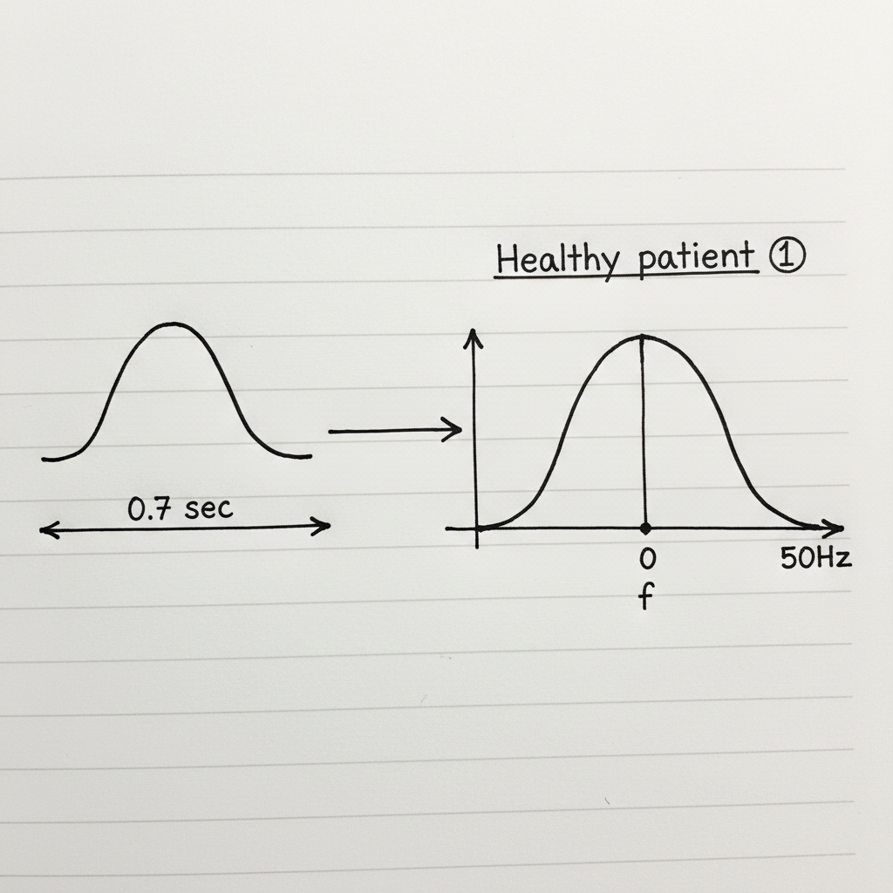

# Frequency Analysis of Biomedical Signals

Frequency analysis is a critical technique in biomedical engineering used to analyze signals like Electrocardiograms (ECG) by examining their constituent frequencies. This approach provides insights that are not apparent in the standard time-domain view of the signal.

## 1. Signal Storage and Digitization

Biomedical signals are inherently **analog** in nature, meaning they are continuous functions of time. For modern computational analysis and efficient storage, these signals must be converted into a **digital** format.

*   **Analog Signal**: A continuous signal where the time-varying feature represents some other time-varying quantity.
*   **Digital Signal**: A discrete-time signal, represented as a sequence of numbers.

The process of converting an analog signal to a digital one is known as **digitization**, which primarily involves two steps: sampling and quantization.

## 2. Signal Analysis: Time Domain vs. Frequency Domain

Once a signal is digitized, it can be analyzed in two different domains to extract useful information.

### Time-Domain Analysis
This involves observing the signal's amplitude as it changes over time. Key features include:
*   Pulse duration (e.g., the duration of a heartbeat, noted as `1 pulse = 0.6 sec`)
*   Peak amplitude
*   Signal morphology (shape)

### Frequency-Domain Analysis
This involves breaking down the signal into the various frequencies it contains. This is typically done using the **Fourier Transform**. This method reveals periodic patterns and the distribution of signal power across different frequencies.

## 3. Application: Comparative Analysis of Patient Data

Frequency analysis is particularly powerful for diagnostics, as it can highlight subtle differences between signals from healthy individuals and those with medical conditions.

### Healthy Patient Example

The frequency spectrum of a signal from a healthy individual typically exhibits a characteristic distribution of frequencies. For an ECG, this reflects a normal heart rhythm.

### Patient with a Condition

A signal from a patient with a medical condition may show a different frequency spectrum. The distribution might be shifted, have different peak frequencies, or be narrower/broader. These changes serve as biomarkers for diagnosis.

### Comparison and Feature Reduction

By comparing the frequency spectra, we can perform a diagnosis:

*   **Comparison based on frequency**: Identify shifts in dominant frequencies or changes in the power spectrum.
*   **Comparison based on duration**: Compare time-domain features like the duration of signal events.

Frequency analysis often helps in **feature reduction**. Instead of analyzing thousands of data points in a time-domain signal, we can focus on a few key frequency components that are most informative for diagnosis. This reduces the number of independent features needed for a machine learning model or clinical assessment, making the process more efficient and effective.

---

