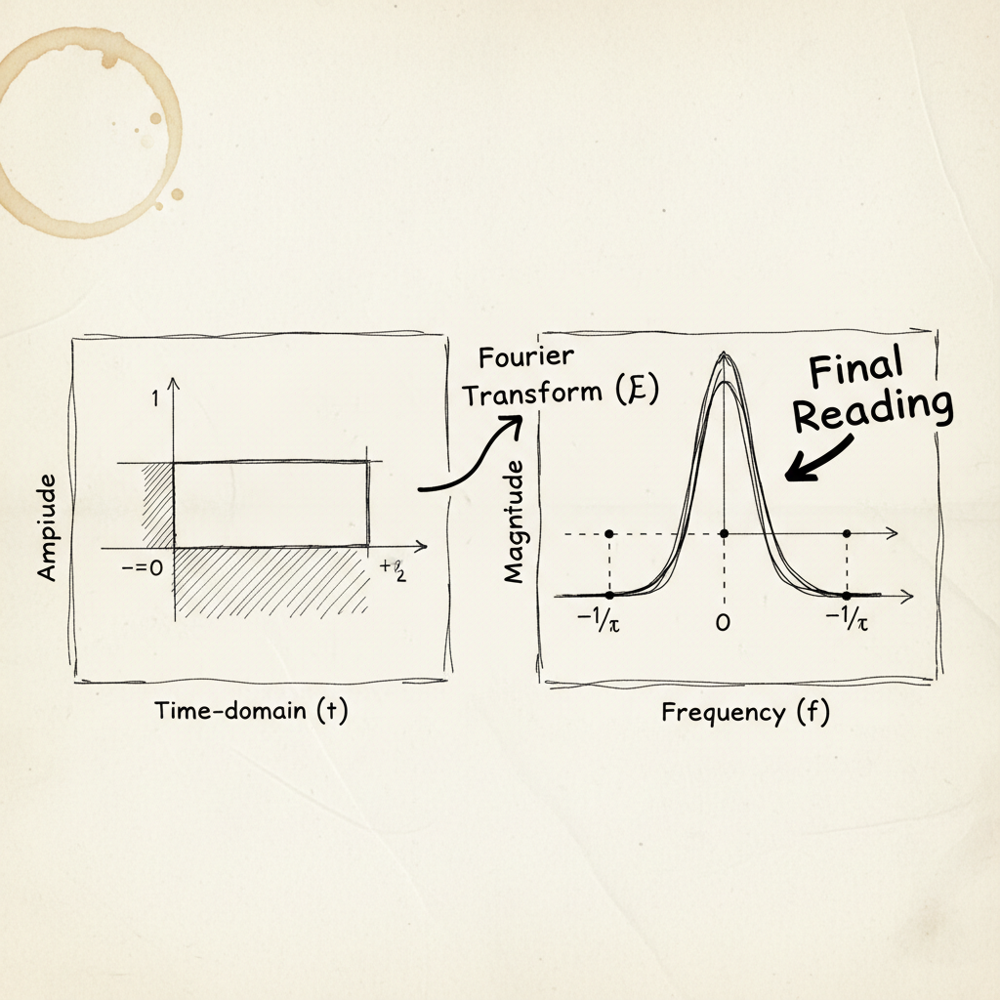
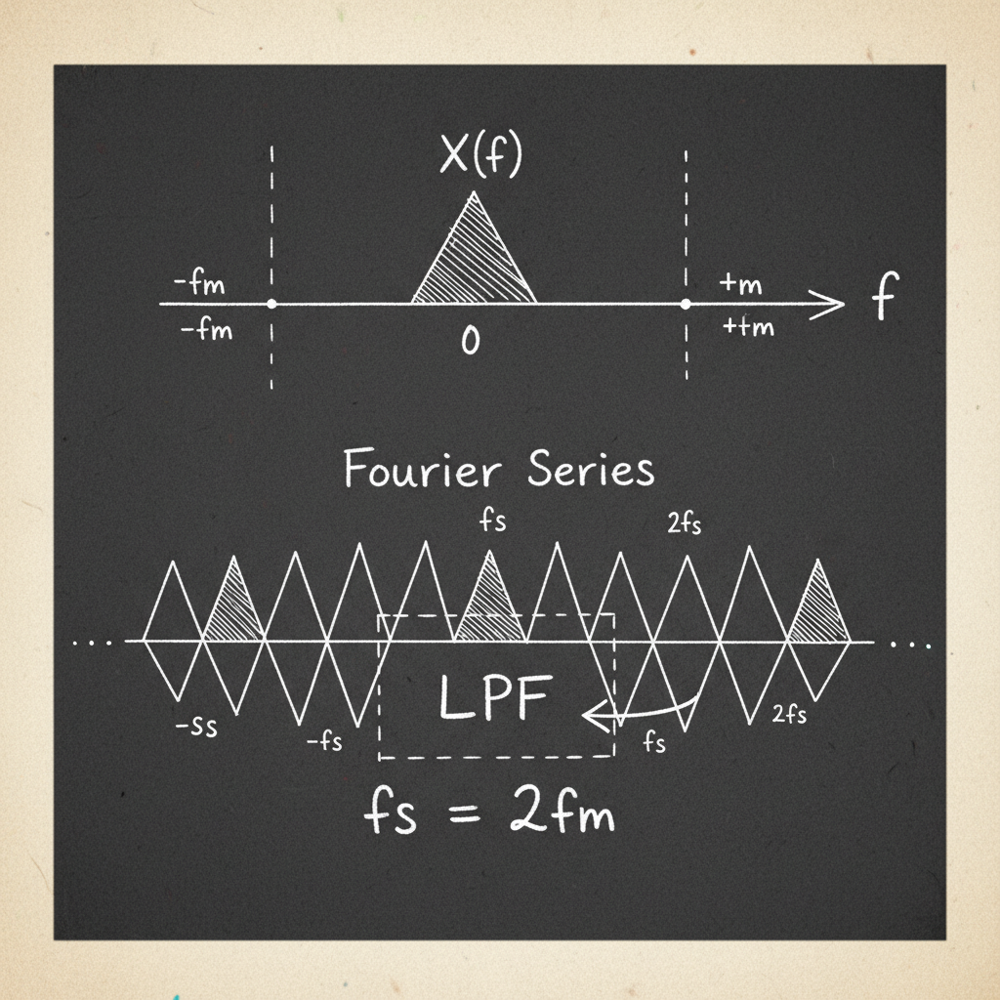

# Signal Processing: The Fourier Transform and Sampling Theorem

This document covers fundamental concepts in signal processing, including the Fourier Transform, its application to common signals, and the principles of the Nyquist-Shannon Sampling Theorem.

## The Fourier Transform

The Fourier Transform is a mathematical tool that decomposes a function of time, such as a signal, into the frequencies that make it up. It transforms a signal from the time domain to the frequency domain.

### Definitions

**Forward Fourier Transform (Time to Frequency):**
This transform converts a time-domain signal `x(t)` into its frequency-domain representation `X(jω)`.

`X(jω) = ∫[-∞ to ∞] x(t) * e^(-jωt) dt`

**Inverse Fourier Transform (Frequency to Time):**
This transform reconstructs the original time-domain signal from its frequency-domain representation.

`x(t) = (1/2π) ∫[-∞ to ∞] X(jω) * e^(jωt) dω`

### Common Fourier Transform Pairs

Below are some examples of common signals and their Fourier Transforms.

*   **Dirac Delta Function:** The signal `f(t) = δ(t)` is an impulse at `t=0`. Its Fourier Transform is a constant value of 1 for all frequencies. `F{δ(t)} = 1`.
*   **Sinusoidal Function:** A signal like `f(t) = sin(ω₀t)` is represented in the frequency domain by two impulses at `+ω₀` and `-ω₀`. The exact transform is `F{sin(ω₀t)} = (π/j)[δ(ω - ω₀) - δ(ω + ω₀)]`. The notes show the transform for `cos(ω₀t)`, which is `F{cos(ω₀t)} = π[δ(ω - ω₀) + δ(ω + ω₀)]`.

*   **Rectangular Pulse:** A rectangular pulse `f(t) = rect(t/τ)` has a width of `τ` in the time domain. Its Fourier Transform is the sinc function: `F{rect(t/τ)} = τ * sinc(ωτ / 2π)`.

## The Nyquist-Shannon Sampling Theorem

The sampling theorem is a fundamental principle in digital signal processing that establishes the conditions necessary to perfectly reconstruct a continuous-time signal from a sequence of its samples.

### Statement of the Theorem

If the highest frequency component present in a continuous-time signal `x(t)` is `f_max`, and the signal is sampled at a rate `f_s` such that `f_s > 2 * f_max`, then the original signal `x(t)` can be exactly reconstructed from its samples.

The minimum sampling rate, `f_s = 2 * f_max`, is known as the **Nyquist rate**.

### Signal Reconstruction using Interpolation

Reconstruction is achieved using an ideal interpolation function, which is the sinc function:

`g(t) = sin(2π * f_max * t) / (2π * f_max * t)`

The reconstructed signal `x_r(t)` is given by the sum of sinc functions scaled by the sample values `x(nTs)`:

`x_r(t) = Σ[n=-∞ to ∞] x(nTs) * g(t - nTs)`

If the sampling theorem is satisfied, then the reconstructed signal is identical to the original: `x_r(t) = x(t)`.

## The Mathematics of Ideal Sampling

### Time-Domain Model

Ideal sampling can be modeled as the multiplication of the continuous-time signal `x(t)` by an **impulse train** `p(t)`.

*   **Impulse Train:** `p(t) = Σ[n=-∞ to ∞] δ(t - nTs)`, where `Ts` is the sampling period (`Ts = 1/f_s`).
*   **Sampled Signal:** `xp(t) = x(t) * p(t)`

### Frequency-Domain Analysis

Multiplication in the time domain is equivalent to convolution in the frequency domain.

`Xp(jω) = (1/2π) [X(jω) * P(jω)]`

*   The Fourier Transform of the impulse train `p(t)` is another impulse train `P(jω)` in the frequency domain:
    `P(jω) = (2π/Ts) * Σ[n=-∞ to ∞] δ(ω - nωs)`, where `ωs = 2π/Ts` is the sampling frequency in radians/sec.

*   Convolving `X(jω)` with `P(jω)` results in the spectrum of the original signal `X(jω)` being replicated at integer multiples of the sampling frequency `ωs`.

`Xp(jω) = (1/Ts) * Σ[n=-∞ to ∞] X(j(ω - nωs))`

This means the spectrum of the sampled signal consists of shifted copies of the original signal's spectrum.

To recover the original signal, a **Low Pass Filter (LPF)** is applied to the sampled signal's spectrum `Xp(jω)`. This filter isolates the central copy of the spectrum (the one centered at ω=0) and removes all the replicated copies, thus restoring the original signal's spectrum `X(jω)`.

---

