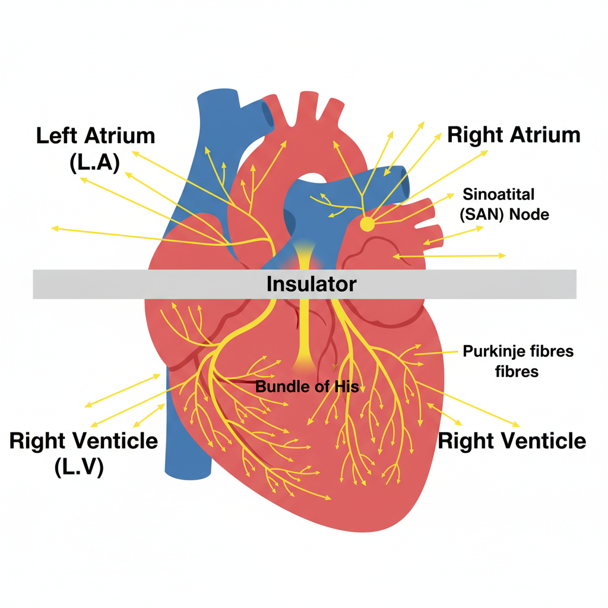

# ECG Signals and Cardiac Conduction

This document explains the fundamentals of electrocardiogram (ECG) signals, how they are generated by the heart's electrical system, and the underlying cellular mechanisms.

## The ECG Waveform

An ECG is a recording of the electrical activity of the heart. A typical waveform for a single heartbeat is known as the PQRST complex.

Each part of the waveform corresponds to a specific electrical event in the heart:

*   **P Wave:** Represents the depolarization of the atria, which leads to atrial contraction.
*   **QRS Complex:** Represents the rapid depolarization of the ventricles. The notes identify the `R-S` segment with ventricular depolarization. This large spike is due to the greater muscle mass of the ventricles.
*   **T Wave:** Represents the repolarization of the ventricles, as they electrically reset for the next heartbeat.

## The Heart's Electrical Conduction System

The coordinated contraction of the heart muscle is controlled by a specialized electrical conduction system. The signal originates in the heart's natural pacemaker and spreads in a specific sequence.

### Sequence of Conduction

1.  **Sinoatrial (SA) Node:** Often called the heart's natural pacemaker. The notes correctly identify it as a collection of *"specific type of muscle cell to generate a clock signal."* These cells spontaneously depolarize to initiate the electrical impulse for each heartbeat. The brain, via the autonomic nervous system, can modulate the rate set by the SA node (e.g., increase it during exercise) but does not generate each stimulus directly.

2.  **Atrial Depolarization & Contraction:** The impulse from the SA node spreads across both atria, causing them to depolarize (P wave on ECG) and contract, pushing blood into the ventricles.

3.  **AV Node & Bundle of His:** The signal then reaches the atrioventricular (AV) node and passes through the Bundle of His. An important **delay** occurs here, which is crucial as it allows the ventricles to fill completely with blood before they contract.

4.  **Ventricular Depolarization & Contraction:** After the delay, the signal travels rapidly down the bundle branches and through the **Purkinje fibers**, which spread the impulse throughout the ventricular muscle. This causes the ventricles to depolarize (QRS complex on ECG) and contract forcefully, pumping blood to the lungs and the rest of the body.

## Cellular Mechanisms

### Action Potential

The electrical signals are generated by action potentials (APs), which are rapid changes in the membrane voltage of the heart cells.

The graph above illustrates the pacemaker potential corresponding to the SA Node. Unlike other muscle cells, these cells do not have a stable resting potential. They slowly depolarize until they reach a threshold, at which point an action potential is fired. This cyclical activity is what creates the regular "clock signal".

### Cardiomyocytes and Gap Junctions

Cardiomyocytes are the muscle cells of the heart. They are electrically connected to each other by structures called **Gap Junctions**.

As the diagram shows, these gap junctions function as *"electric gates,"* allowing the action potential—carried by the flow of ions like Sodium (Na+) and Calcium (Ca²⁺)—to pass directly and quickly from one cell to the next. This enables the entire myocardium (heart muscle) of the atria and ventricles to contract as a single, coordinated unit, which is essential for efficient pumping.

---

